# Excel Advanced Lookups and Logical Functions

> **A recruiter-facing portfolio demonstrating advanced Excel lookup techniques, logical functions, and dynamic data retrieval.**

**Author:** Abid Hasan Chowdhury Ovi  
**Role:** Aspiring Data & Business Intelligence Analyst  
**Tools:** Microsoft Excel | Lookup Functions | Logical Analysis | Dynamic Arrays

---

## Project Focus

- **Logical Functions** — `IFS`, `Nested IF`, `SWITCH` for conditional classification
- **Lookup Functions** — `VLOOKUP`, `INDEX/MATCH`, `XLOOKUP` for data retrieval
- **Dynamic Arrays** — `CHOOSE`, `CHOOSECOLS`, `TRANSPOSE` for flexible outputs
- **Advanced Techniques** — Multi-criteria lookups, cross-table searches, data cleaning with `TRIM`

---

## Table of Contents

1. [Dataset Structure](#1-dataset-structure)
2. [Age Classification](#2-age-classification--ifs-nested-if-switch)
3. [VLOOKUP Record Retrieval](#3-employee-record-retrieval-with-vlookup)
4. [VLOOKUP Multiple Columns](#4-returning-multiple-columns-with-vlookup)
5. [Dynamic VLOOKUP with COLUMNS](#5-copy-across-vlookup-with-columns)
6. [Advanced INDEX/MATCH](#6-advanced-indexmatch-use-cases)
7. [XLOOKUP Entire Record](#7-returning-entire-record-with-xlookup)
8. [XLOOKUP + TRANSPOSE](#8-horizontal-to-vertical-summary-with-xlookup--transpose)
9. [XLOOKUP + CHOOSE](#9-building-custom-return-array-with-choose)
10. [XLOOKUP + CHOOSECOLS](#10-returning-selected-columns-with-choosecols)
11. [Multi-Criteria XLOOKUP](#11-multiple-criteria-xlookup)
12. [Nested XLOOKUP Two-Way](#12-dynamic-two-way-lookup-with-nested-xlookup)
13. [Search Across Tables](#13-searching-across-multiple-tables)
14. [Clean Lookup with TRIM](#14-cleaning-lookup-values-with-trim)

---

## 1. Dataset Structure

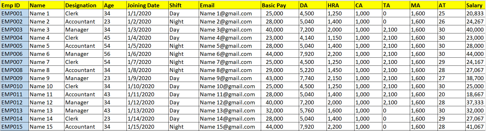

Employee and payroll dataset with complete compensation breakdown.

| Field | Description |
|-------|-------------|
| `Emp ID` | Unique employee identifier |
| `Name` | Employee name |
| `Designation` | Role (Clerk, Accountant, Manager) |
| `Age` | Employee age |
| `Joining Date` | Date of joining |
| `Shift` | Work shift (Day / Night) |
| `Email` | Contact email |
| `Basic Pay` | Base salary |
| `DA` | Dearness Allowance |
| `HRA` | House Rent Allowance |
| `CA` | Conveyance Allowance |
| `TA` | Travel Allowance |
| `MA` | Medical Allowance |
| `AT` | Attendance |
| `Salary` | Net salary |

---

## 2. Age Classification — IFS, Nested IF, SWITCH

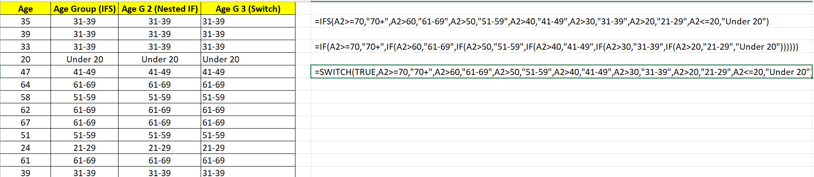

Three methods to classify employees into age groups. All produce identical results.

| Method | Formula |
|--------|---------|
| **IFS** | `=IFS(A2>=70,"70+",A2>60,"61-69",A2>50,"51-59",A2>40,"41-49",A2>30,"31-39",A2>20,"21-29",A2<=20,"Under 20")` |
| **Nested IF** | `=IF(A2>=70,"70+",IF(A2>60,"61-69",IF(A2>50,"51-59",IF(A2>40,"41-49",IF(A2>30,"31-39",IF(A2>20,"21-29","Under 20"))))))` |
| **SWITCH** | `=SWITCH(TRUE,A2>=70,"70+",A2>60,"61-69",A2>50,"51-59",A2>40,"41-49",A2>30,"31-39",A2>20,"21-29",A2<=20,"Under 20")` |

**Age Groups:** Under 20 | 21-29 | 31-39 | 41-49 | 51-59 | 61-69 | 70+

**Recruiter Takeaway:** Demonstrates three approaches to the same logical problem — modern `IFS`, classic `Nested IF`, and pattern-based `SWITCH`.

---

## 3. Employee Record Retrieval with VLOOKUP

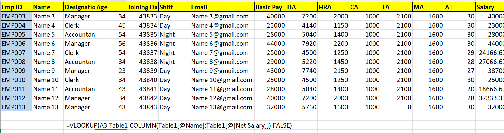

Retrieve complete employee records dynamically using `VLOOKUP` with structured references.

```excel
=VLOOKUP(A3,Table1,COLUMN(Table1[@Name]:Table1[@Net Salary]),FALSE)
```

**How it works:** Uses `COLUMN()` with structured table references to dynamically calculate the column index, allowing the formula to return multiple fields from the employee table.

---

## 4. Returning Multiple Columns with VLOOKUP

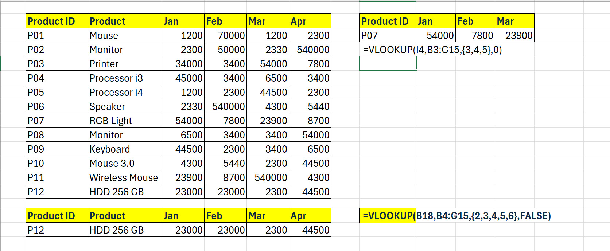

Use array constants to return multiple columns in a single `VLOOKUP` formula.

| Scenario | Formula |
|----------|---------|
| Return columns 3, 4, 5 | `=VLOOKUP(I4,B3:G15,{3,4,5},0)` |
| Return columns 2, 3, 4, 5, 6 | `=VLOOKUP(B18,B4:G15,{2,3,4,5,6},FALSE)` |

**Recruiter Takeaway:** Array constants let `VLOOKUP` spill multiple columns without writing separate formulas.

---

## 5. Copy-Across VLOOKUP with COLUMNS

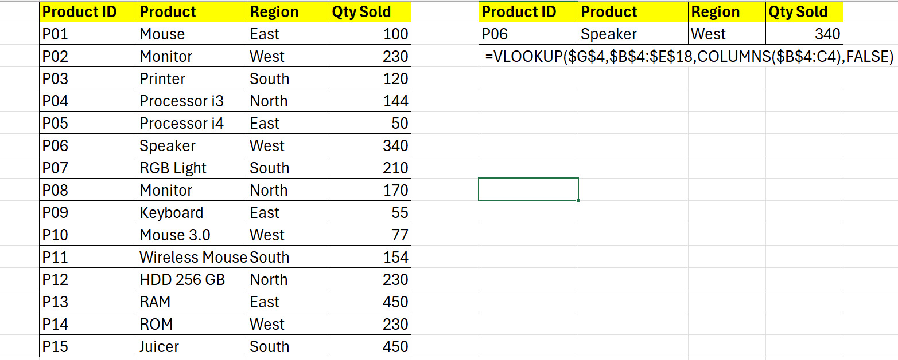

Dynamic column indexing that auto-increments when copied across cells.

```excel
=VLOOKUP($G$4,$B$4:$E$18,COLUMNS($B$4:C4),FALSE)
```

**How it works:** `COLUMNS($B$4:C4)` returns `2`, then `3`, then `4` as the formula is dragged right — making the lookup fully dynamic.

---

## 6. Advanced INDEX/MATCH Use Cases

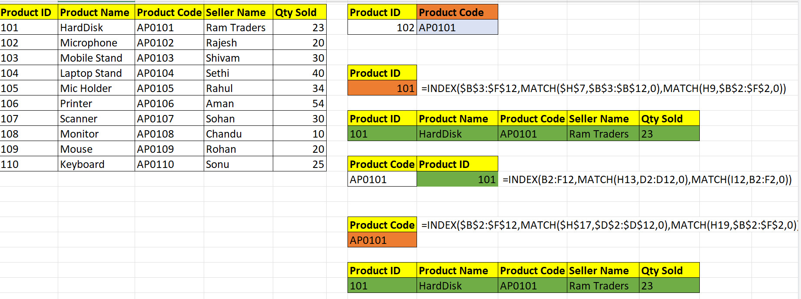

Two-way lookups using `INDEX` with dual `MATCH` functions — flexible row and column retrieval.

| Scenario | Formula |
|----------|---------|
| Two-way lookup (Product ID + Header) | `=INDEX($B$3:$F$12,MATCH($H$7,$B$3:$B$12,0),MATCH(H9,$B$2:$F$2,0))` |
| Lookup by Product Code, return any column | `=INDEX(B2:F12,MATCH(H13,D2:D12,0),MATCH(I12,B2:F2,0))` |
| Lookup by Product Code (locked references) | `=INDEX($B$2:$F$12,MATCH($H$17,$D$2:$D$12,0),MATCH(H19,$B$2:$F$2,0))` |

**Recruiter Takeaway:** `INDEX/MATCH` is more flexible than `VLOOKUP` — it can look left, right, and perform two-dimensional searches.

---

## 7. Returning Entire Record with XLOOKUP

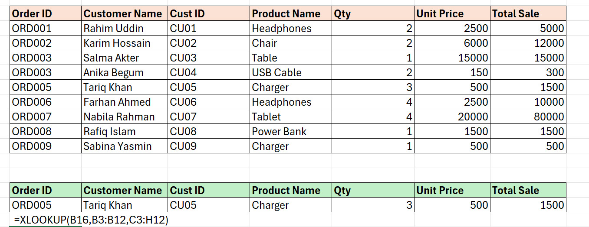

Modern replacement for `VLOOKUP` — returns an entire record with one formula.

```excel
=XLOOKUP(B16,B3:B12,C3:H12)
```

**How it works:** `XLOOKUP` searches `B3:B12` for the Order ID and returns the full row from `C3:H12` — no column index needed, and it works left-to-right or right-to-left.

---

## 8. Horizontal to Vertical Summary with XLOOKUP + TRANSPOSE

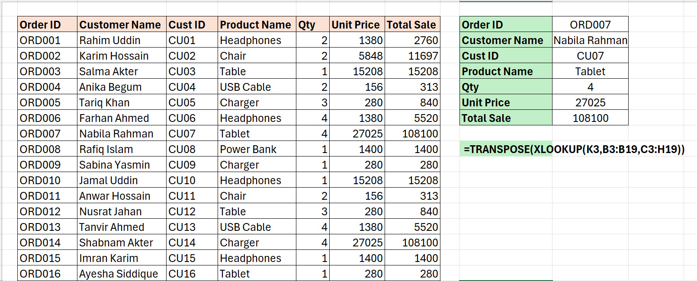

Convert a horizontal record into a vertical layout.

```excel
=TRANSPOSE(XLOOKUP(K3,B3:B19,C3:H19))
```

**How it works:** `XLOOKUP` retrieves the horizontal record; `TRANSPOSE` flips it into a vertical list — perfect for summary dashboards.

---

## 9. Building Custom Return Array with CHOOSE

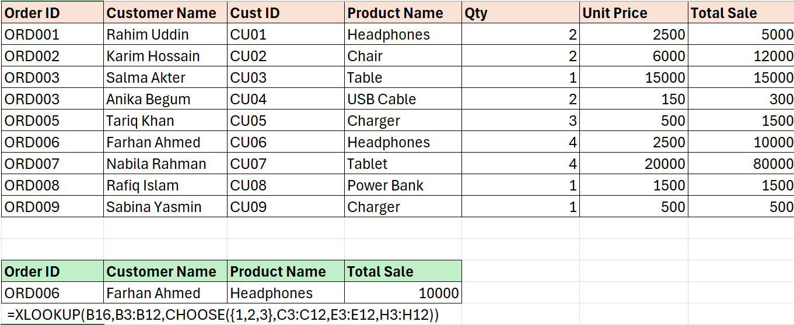

Return non-contiguous columns in a custom order using `CHOOSE`.

```excel
=XLOOKUP(B16,B3:B12,CHOOSE({1,2,3},C3:C12,E3:E12,H3:H12))
```

**How it works:** `CHOOSE` creates a virtual array from columns C, E, and H. `XLOOKUP` returns only those three columns in the specified order.

---

## 10. Returning Selected Columns with CHOOSECOLS

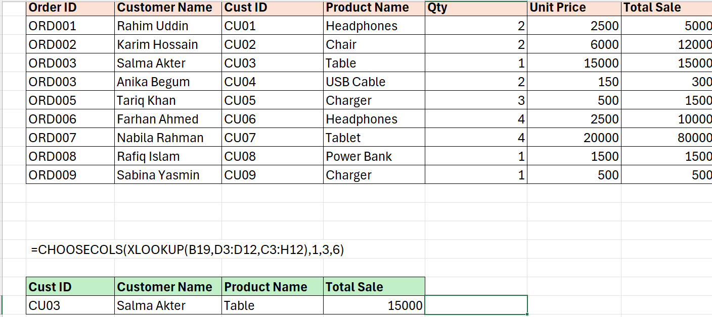

Excel 365+ dynamic array function to pick specific columns from a lookup result.

```excel
=CHOOSECOLS(XLOOKUP(B19,D3:D12,C3:H12),1,3,6)
```

**How it works:** `XLOOKUP` returns the full record; `CHOOSECOLS` extracts only columns 1, 3, and 6 — cleaner than `CHOOSE` for modern Excel.

---

## 11. Multiple Criteria XLOOKUP

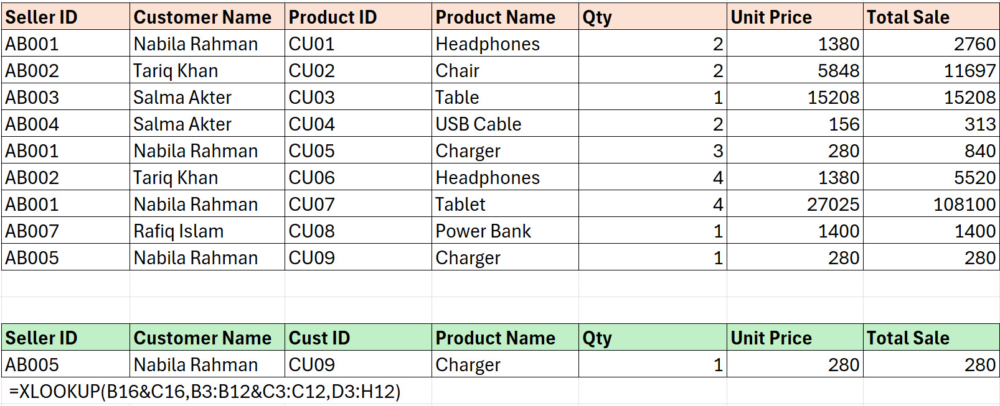

Lookup using two criteria by concatenating lookup values and arrays.

```excel
=XLOOKUP(B16&C16,B3:B12&C3:C12,D3:H12)
```

**How it works:** Concatenates `Seller ID` and `Product ID` into a single lookup value, matches against concatenated columns, and returns the full record.

---

## 12. Dynamic Two-Way Lookup with Nested XLOOKUP

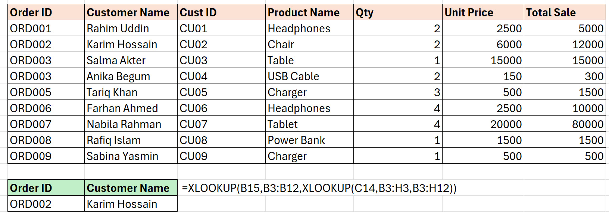

Use one `XLOOKUP` to find the row, and a nested `XLOOKUP` to find the column.

```excel
=XLOOKUP(B15,B3:B12,XLOOKUP(C14,B3:H3,B3:H12))
```

**How it works:** Inner `XLOOKUP` finds the column index; outer `XLOOKUP` finds the row — a true two-dimensional lookup without `INDEX/MATCH`.

---

## 13. Searching Across Multiple Tables

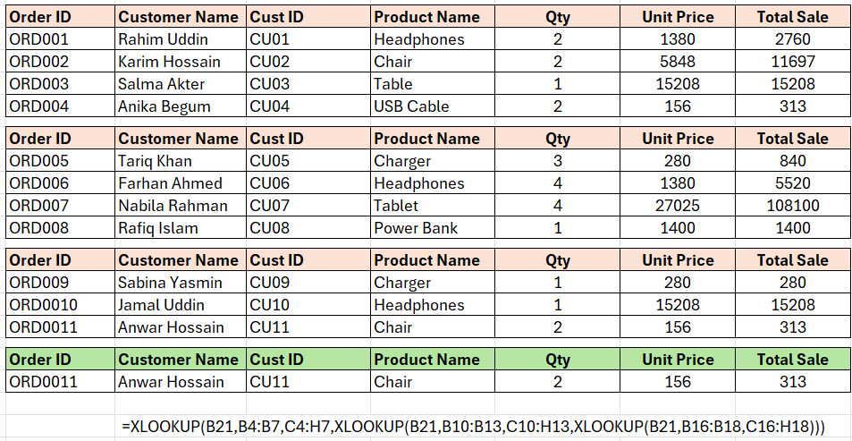

Cascading `XLOOKUP` that searches multiple tables sequentially until a match is found.

```excel
=XLOOKUP(B21,B4:B7,C4:H7,XLOOKUP(B21,B10:B13,C10:H13,XLOOKUP(B21,B16:B18,C16:H18)))
```

**How it works:** If not found in Table 1, searches Table 2; if not found there, searches Table 3 — elegant fallback logic in a single formula.

---

## 14. Cleaning Lookup Values with TRIM

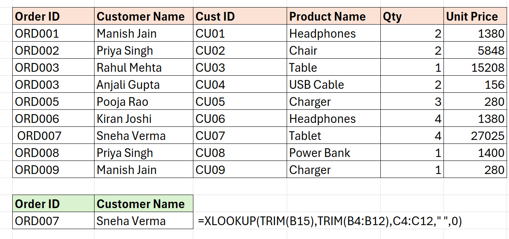

Handle dirty data with extra spaces using `TRIM` to normalize lookup values.

```excel
=XLOOKUP(TRIM(B15),TRIM(B4:B12),C4:C12," ",0)
```

**How it works:** `TRIM` removes leading/trailing/excess spaces from both the lookup value and the lookup array, ensuring matches even with inconsistent data entry.

---

## Recruiter Value & Key Takeaways

| Skill Area | Evidence |
|------------|----------|
| **Logical Functions** | `IFS`, `Nested IF`, `SWITCH` for conditional classification |
| **Classic Lookups** | `VLOOKUP` with array constants, dynamic `COLUMNS`, structured references |
| **Modern Lookups** | `XLOOKUP` for single-formula record retrieval, two-way lookups, multi-table search |
| **Power User Techniques** | `INDEX/MATCH` two-way lookups, `CHOOSE`/`CHOOSECOLS` for custom outputs |
| **Data Quality** | `TRIM` for cleaning inconsistent lookup values |
| **Dynamic Arrays** | `TRANSPOSE`, spilled arrays, modern Excel 365+ functions |

> **Project Conclusion:** Demonstrates progression from classic `VLOOKUP` to modern `XLOOKUP`, with advanced techniques for multi-criteria, multi-table, and cleaned-data scenarios — all documented with visible formulas and clear business logic.

---

*This project is part of the [Data Analytics Portfolio](https://github.com/AbidHasanChowdhuryOvi/Data-Analytics-Portfolio).*
