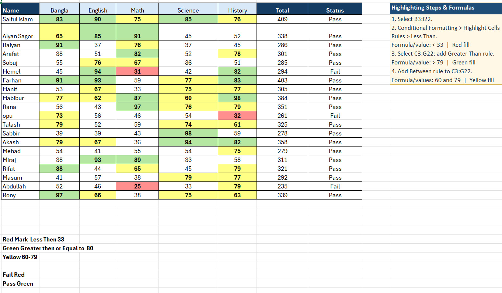
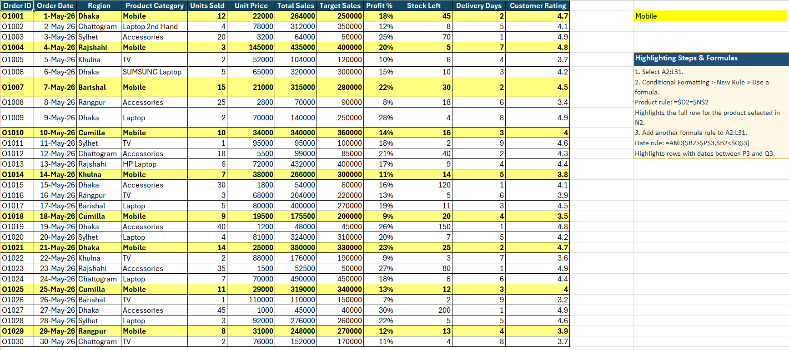
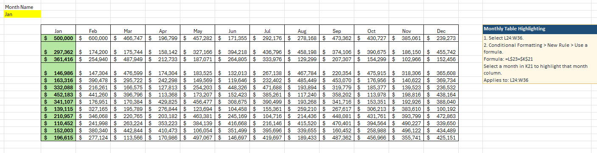
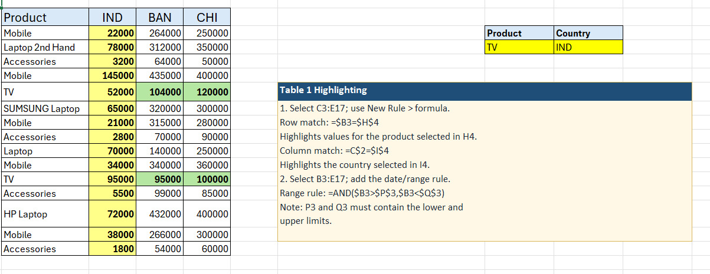

# Excel Conditional Formatting & Dynamic Highlighting

A collection of **4 advanced Excel conditional formatting techniques** that transform static spreadsheets into interactive, visually intuitive dashboards. Each task demonstrates how to use formulas, color scales, and dynamic rules to highlight critical data patterns automatically.

---

## Table of Contents

1. [Student Performance Heatmap & Automated Status](#task-01-student-performance-heatmap--automated-status)
2. [Dynamic Sales Row Highlighting by Product and Date](#task-02-dynamic-sales-row-highlighting-by-product-and-date)
3. [Selected Month Highlighting Across Financial Table](#task-03-selected-month-highlighting-across-financial-table)
4. [Interactive Product-Country Matrix Highlighting](#task-04-interactive-product-country-matrix-highlighting)

---

## Task 01: Student Performance Heatmap & Automated Status

**Objective:** Create a color-coded performance heatmap for student subject scores and automatically determine Pass/Fail status based on total marks.

### Color Scale Rules Applied

| Rule | Condition | Color |
|------|-----------|-------|
| **Red** | Score `< 33` | Red fill |
| **Green** | Score `≥ 80` | Green fill |
| **Yellow** | Score between `60 and 79` | Yellow fill |

### Step-by-Step Instructions

1. **Select** the score range `B3:I22` (all student names and scores).
2. Go to **Home** → **Conditional Formatting** → **Highlight Cells Rules** → **Less Than**.
   - Enter `33` → Choose **Red fill** → Click **OK**.
3. **Select** the subject score range `C3:G22`.
4. Go to **Conditional Formatting** → **Highlight Cells Rules** → **Greater Than**.
   - Enter `79` → Choose **Green fill** → Click **OK**.
5. With `C3:G22` still selected, go to **Conditional Formatting** → **Highlight Cells Rules** → **Between**.
   - Enter `60` and `79` → Choose **Yellow fill** → Click **OK**.

### Status Column Logic

| Status | Condition |
|--------|-----------|
| **Pass** | Total marks meet the passing threshold |
| **Fail** | Total marks below the passing threshold |

**Screenshot:**



**Key Benefit:** Instantly identifies struggling students (red), top performers (green), and average performers (yellow) across all subjects at a glance.

---

## Task 02: Dynamic Sales Row Highlighting by Product and Date

**Objective:** Highlight entire rows in a sales dataset dynamically based on a selected product category and a date range.

### Dataset Columns

`Order ID` | `Order Date` | `Region` | `Product Category` | `Units Sold` | `Unit Price` | `Total Sales` | `Target Sales` | `Profit %` | `Stock Left` | `Delivery Days` | `Customer Rating`

### Dynamic Highlighting Rules

| Rule | Formula | Effect |
|------|---------|--------|
| **Product Match** | `=$D2=$N$2` | Highlights the full row for the product category typed in cell **N2** |
| **Date Range** | `=AND($B2>$P$3,$B2<$Q$3)` | Highlights rows where the order date falls between the dates in **P3** (start) and **Q3** (end) |

### Step-by-Step Instructions

1. **Select** the full data range `A2:I31`.
2. Go to **Home** → **Conditional Formatting** → **New Rule** → **Use a formula to determine which cells to format**.
3. Enter the product rule:
   ```excel
   =$D2=$N$2
   ```
   → Choose a highlight color → Click **OK**.
4. With `A2:I31` still selected, add another **New Rule**.
5. Enter the date range rule:
   ```excel
   =AND($B2>$P$3,$B2<$Q$3)
   ```
   → Choose a different highlight color → Click **OK**.

**Screenshot:**



**Key Benefit:** Creates an interactive sales tracker where changing a single cell (product or date range) instantly highlights all matching records across the dataset.

---

## Task 03: Selected Month Highlighting Across Financial Table

**Objective:** Dynamically highlight an entire month's column in a financial data table based on a selected month name.

### How It Works

A dropdown or typed month name in cell **K21** (e.g., `Jan`) triggers the entire corresponding column in the financial table (`L24:W36`) to highlight automatically.

### Formula Used

```excel
=L$3=$K$21
```

- `L$3` locks the row (header row containing month names) while allowing the column to shift across the table.
- `$K$21` is the absolute reference to the cell where the user selects the month.

### Step-by-Step Instructions

1. **Select** the data range `L24:W36` (the financial values under the month headers).
2. Go to **Home** → **Conditional Formatting** → **New Rule** → **Use a formula to determine which cells to format**.
3. Enter the formula:
   ```excel
   =L$3=$K$21
   ```
4. Choose a highlight color (e.g., green) → Click **OK**.
5. Type any month name (`Jan`, `Feb`, `Mar`, etc.) in cell **K21** to see the corresponding column highlight.

**Screenshot:**



**Key Benefit:** Enables quick month-over-month financial analysis by isolating and visually emphasizing any selected month's data instantly.

---

## Task 04: Interactive Product-Country Matrix Highlighting

**Objective:** Build an interactive matrix where selecting a product and a country from dropdown cells highlights the corresponding row, column, and intersecting cell.

### Dataset Structure

| Product | IND | BAN | CHI |
|---------|-----|-----|-----|
| Mobile | 22000 | 264000 | 250000 |
| Laptop 2nd Hand | 78000 | 312000 | 350000 |
| ... | ... | ... | ... |

### Highlighting Rules

| Rule | Formula | Applies To | Effect |
|------|---------|------------|--------|
| **Row Match** | `=$B3=$H$4` | `C3:E17` | Highlights all values for the product selected in **H4** |
| **Column Match** | `=$C$2=$I$4` | `C3:E17` | Highlights all values for the country selected in **I4** |
| **Range Filter** | `=AND($B3>$P$3,$B3<$Q$3)` | `B3:E17` | Highlights rows where the product value falls between lower (**P3**) and upper (**Q3**) limits |

### Step-by-Step Instructions

1. **Row Highlighting:**
   - Select `C3:E17`.
   - **New Rule** → **Use a formula**:
     ```excel
     =$B3=$H$4
     ```
   - Choose a color → **OK**.

2. **Column Highlighting:**
   - Select `C3:E17`.
   - **New Rule** → **Use a formula**:
     ```excel
     =$C$2=$I$4
     ```
   - Choose a different color → **OK**.

3. **Value Range Highlighting:**
   - Select `B3:E17`.
   - **New Rule** → **Use a formula**:
     ```excel
     =AND($B3>$P$3,$B3<$Q$3)
     ```
   - Choose a third color → **OK**.

> **Note:** Cells **P3** and **Q3** must contain the lower and upper limit values for the range filter to work.

**Screenshot:**



**Key Benefit:** Creates a powerful interactive dashboard where users can filter and visualize sales data by product, country, and value range simultaneously — perfect for executive summaries and regional performance reviews.

---

## Summary

| Task | Technique | Primary Formula(s) |
|------|-----------|-------------------|
| **01** | Performance Heatmap | Built-in rules: Less Than, Greater Than, Between |
| **02** | Dynamic Row Highlighting | `=$D2=$N$2` and `=AND($B2>$P$3,$B2<$Q$3)` |
| **03** | Column Highlighting by Month | `=L$3=$K$21` |
| **04** | Interactive Matrix | `=$B3=$H$4`, `=$C$2=$I$4`, `=AND($B3>$P$3,$B3<$Q$3)` |

---

## Core Concepts Used Across All Tasks

- **Absolute vs. Mixed References** (`$A$1`, `A$1`, `$A1`) — critical for conditional formatting formulas
- **AND() function** — combining multiple criteria in a single rule
- **New Rule > Use a formula** — the gateway to unlimited custom highlighting logic
- **Cell-based inputs** — making dashboards interactive by linking rules to user-editable cells

---

*All examples were created and documented as part of the Data Analytics Portfolio.*
