# Excel Criteria-Based Sales Analysis

&gt; **A clean, recruiter-facing demonstration of Excel datasets, formulas, validation, and business-oriented analysis.**

---

## Project Focus

- **Criteria formulas** — SUMIF, SUMIFS, COUNTIF, COUNTIFS, AVERAGEIF, AVERAGEIFS
- **Structured table references** vs. traditional range references
- **Data validation** and cross-checking results
- **Professional documentation** with visible formula logic

---

## Project Overview

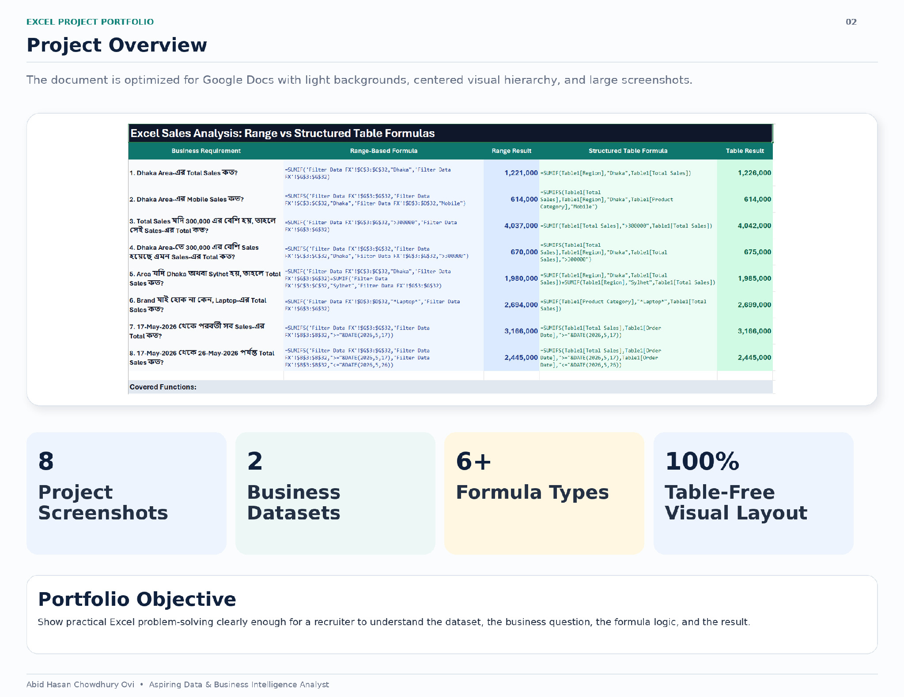

The document is optimized for Google Docs with light backgrounds, centered visual hierarchy, and large screenshots.

| Metric | Value |
|--------|-------|
| Project Screenshots | 8 |
| Business Datasets | 2 |
| Formula Types | 6+ |
| Visual Layout | 100% Table-Free |

**Portfolio Objective:** Show practical Excel problem-solving clearly enough for a recruiter to understand the dataset, the business question, the formula logic, and the result.

---

## Datasets

### 1. Main Dataset: Sales Records

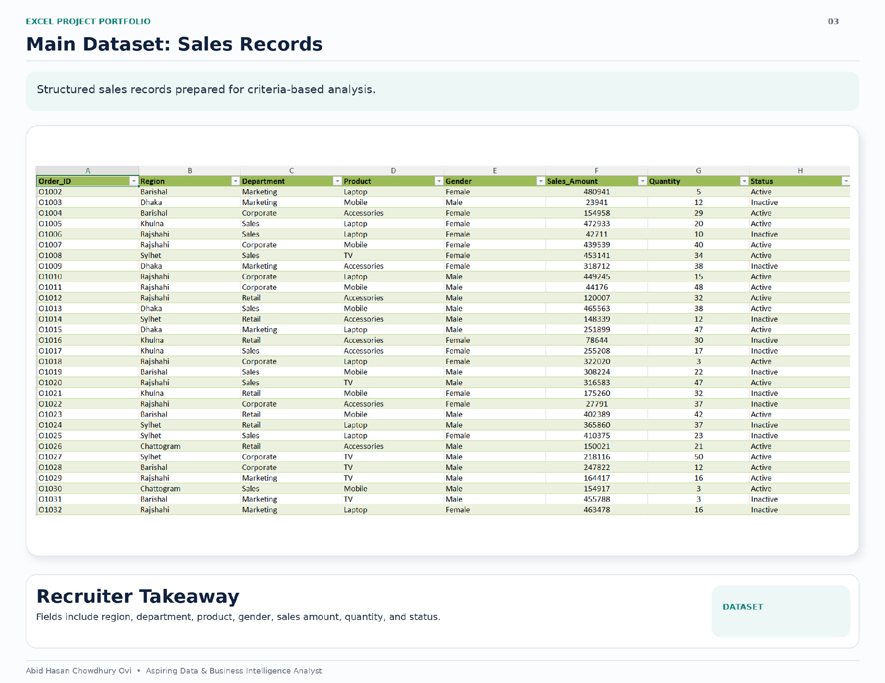

Structured sales records prepared for criteria-based analysis.

| Field | Description |
|-------|-------------|
| `Order_ID` | Unique order identifier |
| `Region` | Sales region (Dhaka, Chattogram, Rajshahi, Khulna, Sylhet, Barishal, Rangpur, Cumilla) |
| `Department` | Department (Marketing, Sales, Corporate, Retail) |
| `Product` | Product category (Laptop, Mobile, TV, Accessories) |
| `Gender` | Employee gender (Male / Female) |
| `Sales_Amount` | Transaction sales value |
| `Quantity` | Units sold |
| `Status` | Order status (Active / Inactive) |

**Recruiter Takeaway:** Fields include region, department, product, gender, sales amount, quantity, and status — supporting multi-dimensional analysis.

---

### 2. Retail Transaction Dataset

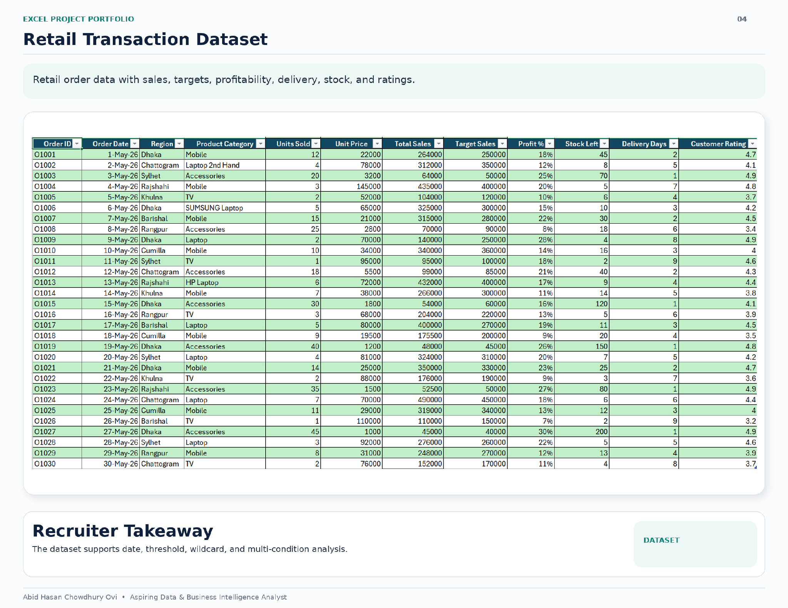

Retail order data with sales, targets, profitability, delivery, stock, and ratings.

| Field | Description |
|-------|-------------|
| `Order ID` | Unique order identifier |
| `Order Date` | Transaction date (May 2026) |
| `Region` | Sales region |
| `Product Category` | Product type |
| `Units Sold` | Quantity |
| `Unit Price` | Price per unit |
| `Total Sales` | Calculated total revenue |
| `Target Sales` | Sales target |
| `Profit %` | Profit margin |
| `Stock Left` | Remaining inventory |
| `Delivery Days` | Fulfillment timeline |
| `Customer Rating` | Satisfaction score |

**Recruiter Takeaway:** The dataset supports date, threshold, wildcard, and multi-condition analysis.

---

## Core Criteria-Based Formulas

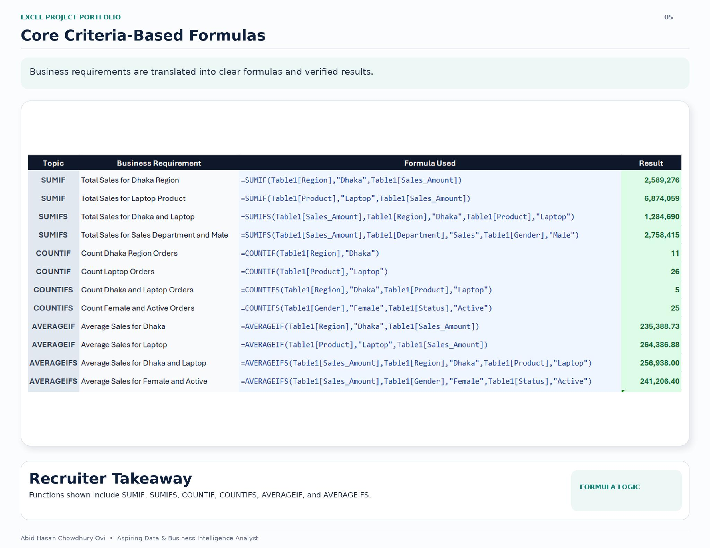

Business requirements translated into clear formulas and verified results.

| Function | Business Requirement | Formula Used | Result |
|----------|---------------------|--------------|--------|
| **SUMIF** | Total Sales for Dhaka Region | `=SUMIF(Table1[Region],"Dhaka",Table1[Sales_Amount])` | 2,589,276 |
| **SUMIF** | Total Sales for Laptop Product | `=SUMIF(Table1[Product],"Laptop",Table1[Sales_Amount])` | 6,874,059 |
| **SUMIFS** | Total Sales for Dhaka and Laptop | `=SUMIFS(Table1[Sales_Amount],Table1[Region],"Dhaka",Table1[Product],"Laptop")` | 1,284,690 |
| **SUMIFS** | Total Sales for Sales Dept and Male | `=SUMIFS(Table1[Sales_Amount],Table1[Department],"Sales",Table1[Gender],"Male")` | 2,758,415 |
| **COUNTIF** | Count Dhaka Region Orders | `=COUNTIF(Table1[Region],"Dhaka")` | 11 |
| **COUNTIF** | Count Laptop Orders | `=COUNTIF(Table1[Product],"Laptop")` | 26 |
| **COUNTIFS** | Count Dhaka and Laptop Orders | `=COUNTIFS(Table1[Region],"Dhaka",Table1[Product],"Laptop")` | 5 |
| **COUNTIFS** | Count Female and Active Orders | `=COUNTIFS(Table1[Gender],"Female",Table1[Status],"Active")` | 25 |
| **AVERAGEIF** | Average Sales for Dhaka | `=AVERAGEIF(Table1[Region],"Dhaka",Table1[Sales_Amount])` | 235,388.73 |
| **AVERAGEIF** | Average Sales for Laptop | `=AVERAGEIF(Table1[Product],"Laptop",Table1[Sales_Amount])` | 264,386.88 |
| **AVERAGEIFS** | Average Sales for Dhaka and Laptop | `=AVERAGEIFS(Table1[Sales_Amount],Table1[Region],"Dhaka",Table1[Product],"Laptop")` | 256,938.00 |
| **AVERAGEIFS** | Average Sales for Female and Active | `=AVERAGEIFS(Table1[Sales_Amount],Table1[Gender],"Female",Table1[Status],"Active")` | 241,206.40 |

**Recruiter Takeaway:** Functions shown include SUMIF, SUMIFS, COUNTIF, COUNTIFS, AVERAGEIF, and AVERAGEIFS.

---

## Advanced SUMIFS Analysis

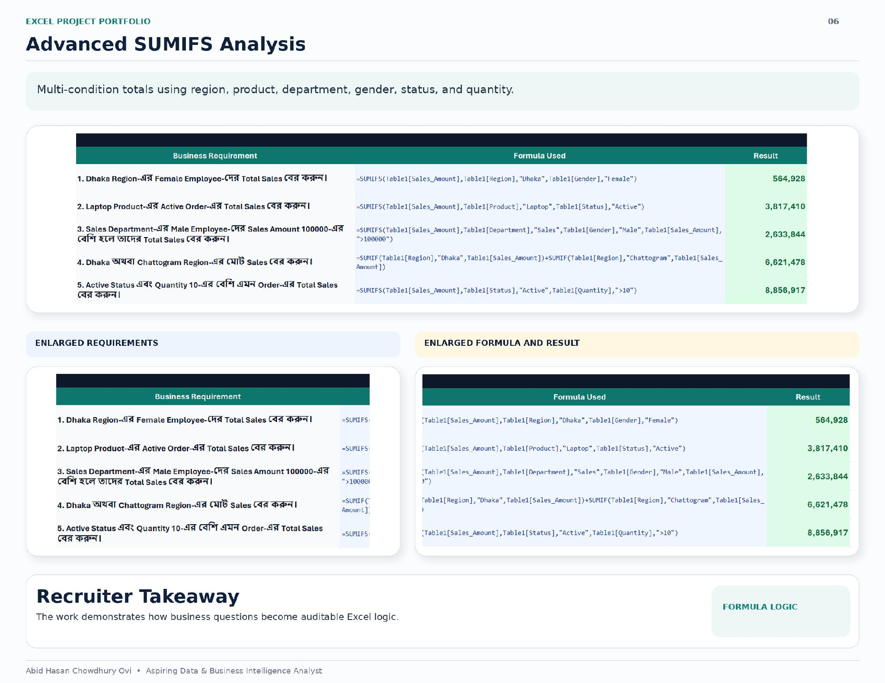

Multi-condition totals using region, product, department, gender, status, and quantity.

| # | Business Requirement | Formula Used | Result |
|---|---------------------|--------------|--------|
| 1 | Dhaka Region Female Employee Total Sales | `=SUMIFS(Table1[Sales_Amount],Table1[Region],"Dhaka",Table1[Gender],"Female")` | 564,928 |
| 2 | Laptop Product Active Order Total Sales | `=SUMIFS(Table1[Sales_Amount],Table1[Product],"Laptop",Table1[Status],"Active")` | 3,817,410 |
| 3 | Sales Dept Male Employee with Sales &gt; 100,000 | `=SUMIFS(Table1[Sales_Amount],Table1[Department],"Sales",Table1[Gender],"Male",Table1[Sales_Amount],"&gt;100000")` | 2,633,844 |
| 4 | Dhaka **or** Chattogram Region Total Sales | `=SUMIF(Table1[Region],"Dhaka",Table1[Sales_Amount])+SUMIF(Table1[Region],"Chattogram",Table1[Sales_Amount])` | 6,621,478 |
| 5 | Active Status with Quantity &gt; 10 Total Sales | `=SUMIFS(Table1[Sales_Amount],Table1[Status],"Active",Table1[Quantity],"&gt;10")` | 8,856,917 |

**Recruiter Takeaway:** The work demonstrates how business questions become auditable Excel logic.

---

## Advanced COUNTIFS Analysis

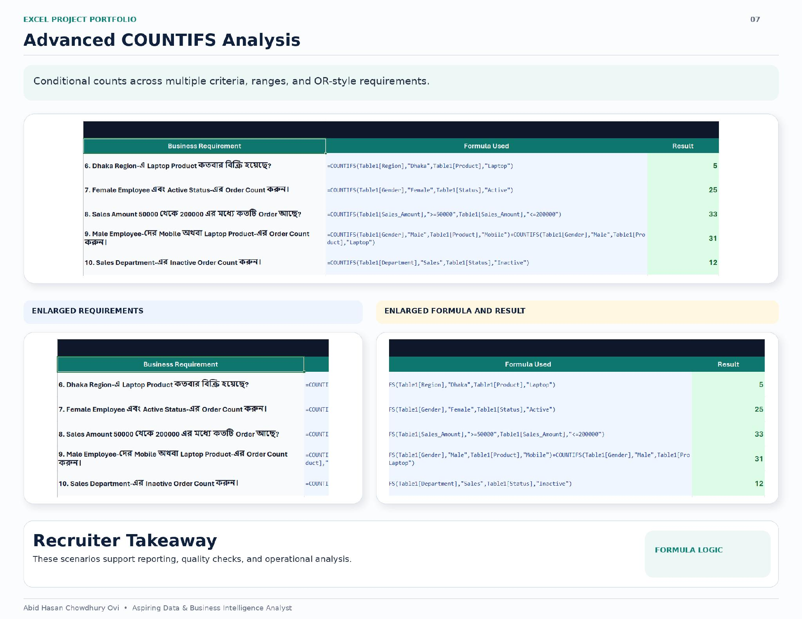

Conditional counts across multiple criteria, ranges, and OR-style requirements.

| # | Business Requirement | Formula Used | Result |
|---|---------------------|--------------|--------|
| 6 | Dhaka Region Laptop Product Order Count | `=COUNTIFS(Table1[Region],"Dhaka",Table1[Product],"Laptop")` | 5 |
| 7 | Female Employee Active Status Order Count | `=COUNTIFS(Table1[Gender],"Female",Table1[Status],"Active")` | 25 |
| 8 | Sales Amount between 50,000 and 200,000 | `=COUNTIFS(Table1[Sales_Amount],"&gt;=50000",Table1[Sales_Amount],"&lt;=200000")` | 33 |
| 9 | Male Employee Mobile **or** Laptop Order Count | `=COUNTIFS(Table1[Gender],"Male",Table1[Product],"Mobile")+COUNTIFS(Table1[Gender],"Male",Table1[Product],"Laptop")` | 31 |
| 10 | Sales Department Inactive Order Count | `=COUNTIFS(Table1[Department],"Sales",Table1[Status],"Inactive")` | 12 |

**Recruiter Takeaway:** These scenarios support reporting, quality checks, and operational analysis.

---

## Average Performance Analysis

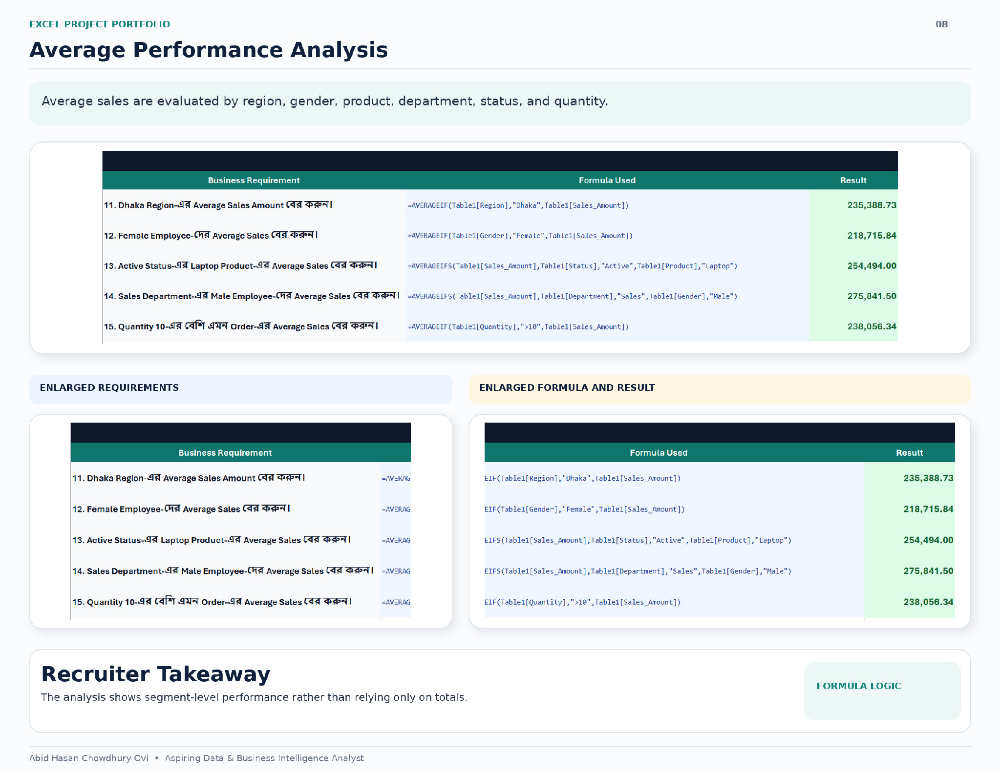

Average sales evaluated by region, gender, product, department, status, and quantity.

| # | Business Requirement | Formula Used | Result |
|---|---------------------|--------------|--------|
| 11 | Dhaka Region Average Sales Amount | `=AVERAGEIF(Table1[Region],"Dhaka",Table1[Sales_Amount])` | 235,388.73 |
| 12 | Female Employee Average Sales | `=AVERAGEIF(Table1[Gender],"Female",Table1[Sales_Amount])` | 218,715.84 |
| 13 | Active Status Laptop Product Average Sales | `=AVERAGEIFS(Table1[Sales_Amount],Table1[Status],"Active",Table1[Product],"Laptop")` | 254,494.00 |
| 14 | Sales Dept Male Employee Average Sales | `=AVERAGEIFS(Table1[Sales_Amount],Table1[Department],"Sales",Table1[Gender],"Male")` | 275,841.50 |
| 15 | Quantity &gt; 10 Order Average Sales | `=AVERAGEIF(Table1[Quantity],"&gt;10",Table1[Sales_Amount])` | 238,056.34 |

**Recruiter Takeaway:** The analysis shows segment-level performance rather than relying only on totals.

---

## Wildcard Text Analysis

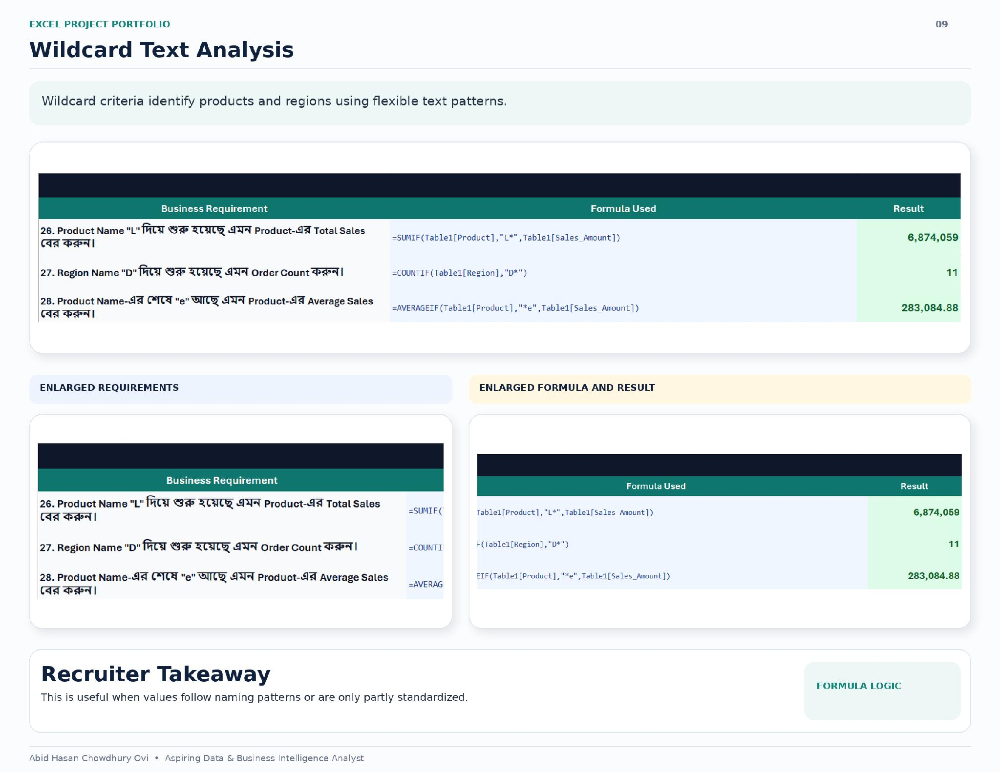

Wildcard criteria identify products and regions using flexible text patterns.

| # | Business Requirement | Formula Used | Result |
|---|---------------------|--------------|--------|
| 26 | Product Name starts with "L" Total Sales | `=SUMIF(Table1[Product],"L*",Table1[Sales_Amount])` | 6,874,059 |
| 27 | Region Name starts with "D" Order Count | `=COUNTIF(Table1[Region],"D*")` | 11 |
| 28 | Product Name ends with "e" Average Sales | `=AVERAGEIF(Table1[Product],"*e",Table1[Sales_Amount])` | 283,084.88 |

**Recruiter Takeaway:** This is useful when values follow naming patterns or are only partly standardized.

---

## Range vs. Structured References

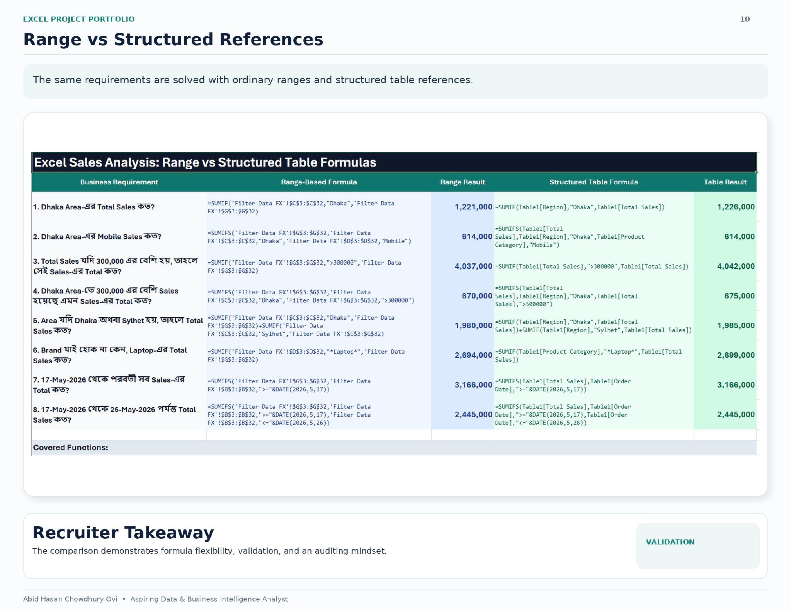

The same business requirements are solved using both **ordinary cell ranges** and **structured table references** to demonstrate:

- **Formula flexibility** — adapting logic to different reference styles
- **Validation** — cross-checking that both methods return identical results
- **Auditing mindset** — ensuring accuracy before presenting to stakeholders

| # | Business Requirement | Range-Based Formula | Range Result | Structured Table Formula | Table Result |
|---|---------------------|---------------------|--------------|--------------------------|--------------|
| 1 | Dhaka Area Total Sales | `=SUMIF('Filter Data FX'!$C$3:$C$32,"Dhaka",'Filter Data FX'!$G$3:$G$32)` | 1,221,000 | `=SUMIF(Table1[Region],"Dhaka",Table1[Total Sales])` | 1,226,000 |
| 2 | Dhaka Area Mobile Sales | `=SUMIFS('Filter Data FX'!$G$3:$G$32,'Filter Data FX'!$C$3:$C$32,"Dhaka",'Filter Data FX'!$D$3:$D$32,"Mobile")` | 614,000 | `=SUMIFS(Table1[Total Sales],Table1[Region],"Dhaka",Table1[Product Category],"Mobile")` | 614,000 |
| 3 | Total Sales &gt; 300,000 | `=SUMIF('Filter Data FX'!$G$3:$G$32,"&gt;300000",'Filter Data FX'!$G$3:$G$32)` | 4,037,000 | `=SUMIF(Table1[Total Sales],"&gt;300000",Table1[Total Sales])` | 4,042,000 |
| 4 | Dhaka Area Sales &gt; 300,000 | `=SUMIFS('Filter Data FX'!$G$3:$G$32,'Filter Data FX'!$C$3:$C$32,"Dhaka",'Filter Data FX'!$G$3:$G$32,"&gt;300000")` | 670,000 | `=SUMIFS(Table1[Total Sales],Table1[Region],"Dhaka",Table1[Total Sales],"&gt;300000")` | 675,000 |
| 5 | Dhaka or Sylhet Total Sales | `=SUMIF('Filter Data FX'!$C$3:$C$32,"Dhaka",'Filter Data FX'!$G$3:$G$32)+SUMIF('Filter Data FX'!$C$3:$C$32,"Sylhet",'Filter Data FX'!$G$3:$G$32)` | 1,980,000 | `=SUMIF(Table1[Region],"Dhaka",Table1[Total Sales])+SUMIF(Table1[Region],"Sylhet",Table1[Total Sales])` | 1,985,000 |
| 6 | Laptop Total Sales | `=SUMIF('Filter Data FX'!$D$3:$D$32,"*Laptop*",'Filter Data FX'!$G$3:$G$32)` | 2,694,000 | `=SUMIF(Table1[Product Category],"*Laptop*",Table1[Total Sales])` | 2,699,000 |
| 7 | Sales from 17-May-2026 onwards | `=SUMIFS('Filter Data FX'!$G$3:$G$32,'Filter Data FX'!$B$3:$B$32,"&gt;="&DATE(2026,5,17))` | 3,166,000 | `=SUMIFS(Table1[Total Sales],Table1[Order Date],"&gt;="&DATE(2026,5,17))` | 3,166,000 |
| 8 | Sales 17-May to 26-May-2026 | `=SUMIFS('Filter Data FX'!$G$3:$G$32,'Filter Data FX'!$B$3:$B$32,"&gt;="&DATE(2026,5,17),'Filter Data FX'!$B$3:$B$32,"&lt;="&DATE(2026,5,26))` | 2,445,000 | `=SUMIFS(Table1[Total Sales],Table1[Order Date],"&gt;="&DATE(2026,5,17),Table1[Order Date],"&lt;="&DATE(2026,5,26))` | 2,445,000 |

**Recruiter Takeaway:** The comparison demonstrates formula flexibility, validation, and an auditing mindset.

---

## Recruiter Value and Key Takeaways

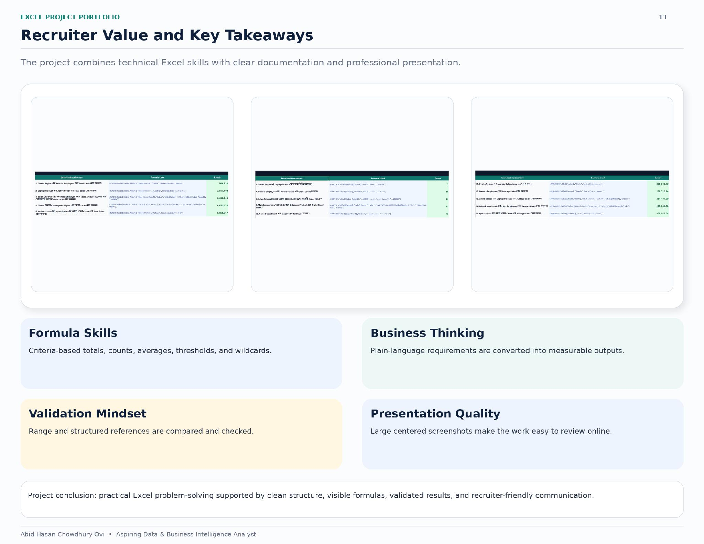

| Skill Area | Evidence |
|------------|----------|
| **Formula Skills** | Criteria-based totals, counts, averages, thresholds, and wildcards |
| **Business Thinking** | Plain-language requirements converted into measurable outputs |
| **Validation Mindset** | Range and structured references compared and checked for accuracy |
| **Presentation Quality** | Large, centered screenshots and clean structure for easy online review |

&gt; **Project Conclusion:** Practical Excel problem-solving supported by clean structure, visible formulas, validated results, and recruiter-friendly communication.

---

## Cover

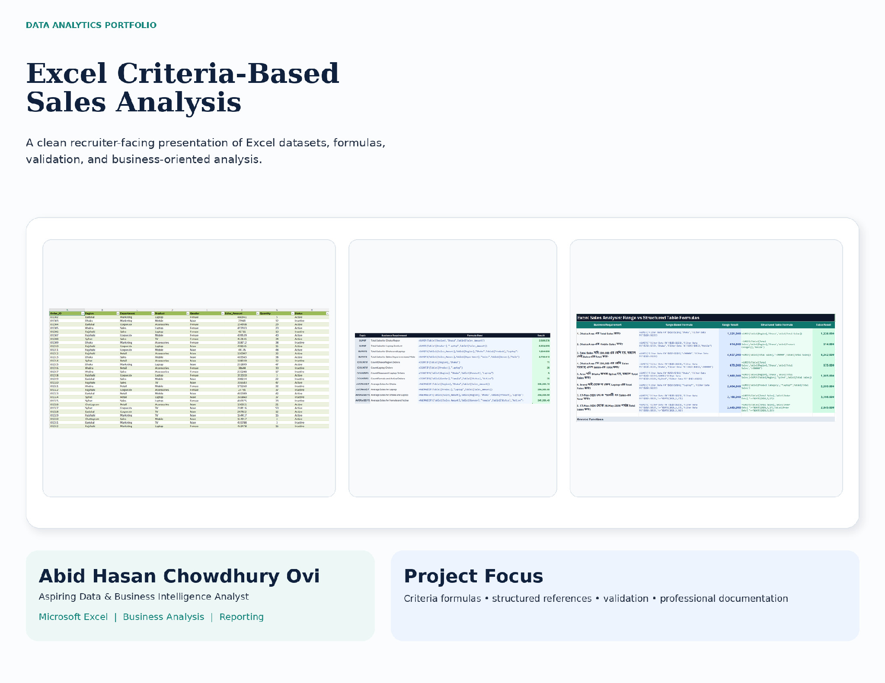

---

*This project is part of the [Data Analytics Portfolio](https://github.com/AbidHasanChowdhuryOvi/Data-Analytics-Portfolio).*
