# Excel Data Cleaning & Transformation

A curated collection of **22 essential Excel techniques** for cleaning, transforming, and standardizing raw data. Each example includes a visual before/after comparison, the specific method used, and the exact formula or shortcut applied.

---

## Table of Contents

1. [Handling Calculation Errors](#1-handling-calculation-errors)
2. [Preserving Long Order IDs](#2-preserving-long-order-ids)
3. [Splitting Full Names with Flash Fill](#3-splitting-full-names-with-flash-fill)
4. [Parsing Combined Sales Details](#4-parsing-combined-sales-details)
5. [Removing Blank Rows Efficiently](#5-removing-blank-rows-efficiently)
6. [Filling Missing Text and Numeric Values](#6-filling-missing-text-and-numeric-values)
7. [Standardizing Mixed Date Displays](#7-standardizing-mixed-date-displays)
8. [Identifying and Removing Duplicates](#8-identifying-and-removing-duplicates)
9. [Clearing Inconsistent Formatting](#9-clearing-inconsistent-formatting)
10. [Cleaning Names with TRIM and PROPER](#10-cleaning-names-with-trim-and-proper)
11. [Reshaping Unstacked Sales Records](#11-reshaping-unstacked-sales-records)
12. [Reshaping Stacked Country Details](#12-reshaping-stacked-country-details)
13. [Replacing Unwanted Characters in Names](#13-replacing-unwanted-characters-in-names)
14. [Reordering Month Columns Chronologically](#14-reordering-month-columns-chronologically)
15. [Standardizing Text Case](#15-standardizing-text-case)
16. [Combining Name Components](#16-combining-name-components)
17. [Extracting Initials, First and Last Name](#17-extracting-initials-first-and-last-name)
18. [Building Dynamic Sentences](#18-building-dynamic-sentences)
19. [Reversing First and Last Names](#19-reversing-first-and-last-names)
20. [Generating Email IDs in Bulk](#20-generating-email-ids-in-bulk)
21. [Extracting Date Components and Reformatting](#21-extracting-date-components-and-reformatting)
22. [Adding Country Codes to Phone Numbers](#22-adding-country-codes-to-phone-numbers)

---

## 1. Handling Calculation Errors

**Problem:** Division formulas return `#DIV/0!` errors when the denominator (Rate) is blank or zero, breaking the Total row.

**Solution:** Wrap the division formula with `IFERROR` to return `0` instead of an error.

| Before | After |
|--------|-------|
| `=E4/D4` → `#DIV/0!` | `=IFERROR(E4/D4,0)` → `0` |

**Formula Used:**
```excel
=IFERROR(E4/D4,0)
```

**Screenshot:**

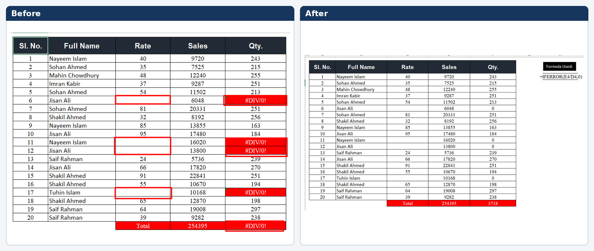

**Key Benefit:** Keeps summary totals (e.g., `SUM`) accurate by replacing errors with a safe default value.

---

## 2. Preserving Long Order IDs

**Problem:** Long numeric Order IDs are automatically converted to scientific notation (e.g., `9.20508E+15`), losing precision.

**Solution:** Format the cells as **Number** with `0` decimal places (or as **Text** before entry).

**Steps:**
1. Select the Order ID column.
2. Press `Ctrl + 1` → Format Cells.
3. Choose **Number** → Set Decimal places to `0`.

**Screenshot:**

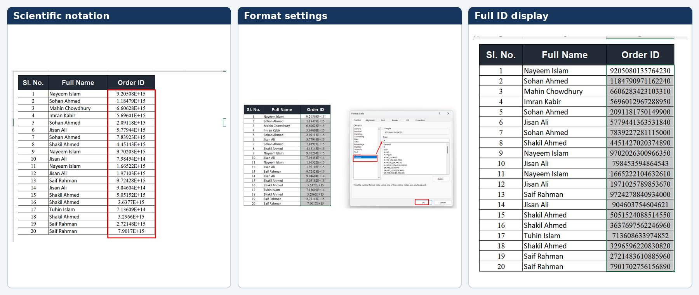

**Key Benefit:** Displays the full 16-digit ID without scientific notation rounding.

---

## 3. Splitting Full Names with Flash Fill

**Problem:** Full names are in a single column; first and last names need to be separated.

**Solution:** Use Excel's **Flash Fill** (`Ctrl + E`) to automatically detect patterns.

**Steps:**
1. In the **First Name** column, manually type the first name from the first row.
2. Select the rest of the empty cells in that column.
3. Press `Ctrl + E`.
4. Repeat for the **Last Name** column.

**Screenshot:**

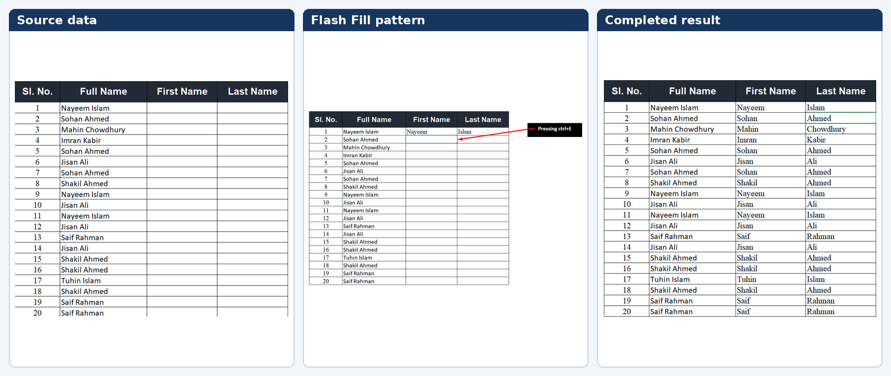

**Key Benefit:** No formulas needed; Excel intelligently learns and applies the pattern across the dataset.

---

## 4. Parsing Combined Sales Details

**Problem:** A single text string contains multiple data points: `Company Invoice Region Item Client`.

**Solution:** Use **Flash Fill** or **Text to Columns** to extract each component into its own column.

**Example:**
- Input: `Samsung 201 East Mobile Albert`
- Output: `East` | `Samsung` | `201` | `Albert` | `Mobile`

**Screenshot:**

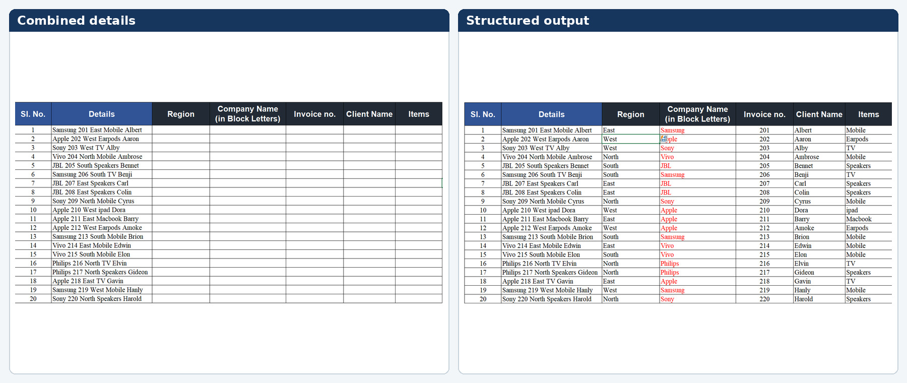

**Key Benefit:** Transforms unstructured text into a structured, analysis-ready table.

---

## 5. Removing Blank Rows Efficiently

**Problem:** Blank rows are scattered throughout the dataset, breaking filters and sorting.

**Solution:** Use **Go To Special** to select all blank cells at once and delete their rows.

**Steps:**
1. Select the entire data range.
2. Press `Ctrl + G` → Click **Special**.
3. Select **Blanks** → Click **OK**.
4. Right-click on any selected blank cell → **Delete** → **Shift cells up** (or **Entire row**).

**Screenshot:**

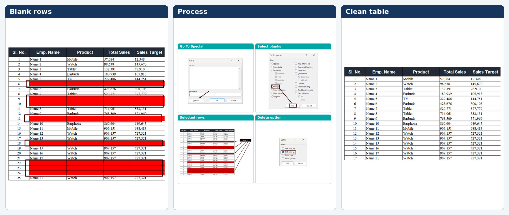

**Key Benefit:** Removes hundreds of blank rows in seconds without manual scrolling.

---

## 6. Filling Missing Text and Numeric Values

**Problem:** Empty cells in text columns (e.g., Region) and numeric columns (e.g., Sales Target) need standardized placeholders.

**Solution:**
- **Text blanks:** Select blanks → Type `N/A` → Press `Ctrl + Enter` to fill all selected cells.
- **Numeric blanks:** Select blanks → Type `0` → Press `Ctrl + Enter`.

**Screenshot:**

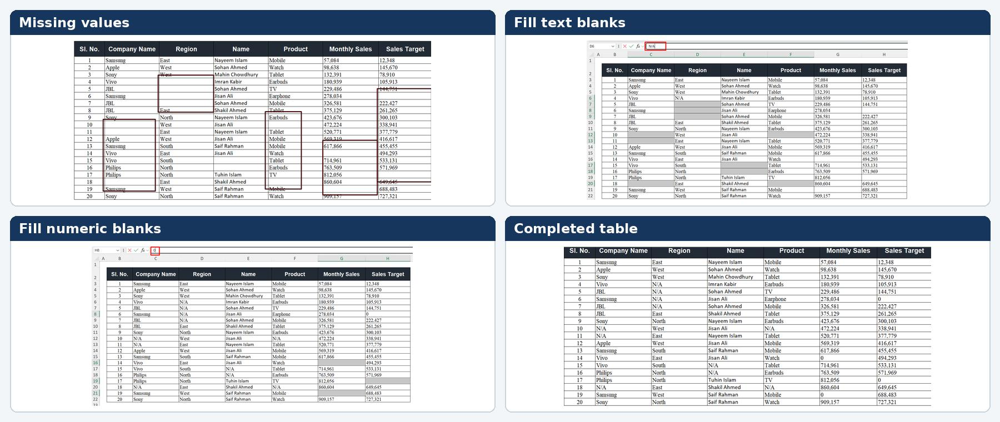

**Key Benefit:** Ensures no empty cells remain for pivot tables, charts, or calculations.

---

## 7. Standardizing Mixed Date Displays

**Problem:** Dates appear in inconsistent formats: `1-Jan-25`, `2025-01-04`, `1/5/2025`, serial numbers like `45672`.

**Solution:** Apply a **Custom Date Format** to unify all entries.

**Format Code:**
```excel
dd-mmm-yyyy
```

**Steps:**
1. Select the date column.
2. Press `Ctrl + 1` → **Custom**.
3. Enter `dd-mmm-yyyy` → Click **OK**.

**Screenshot:**

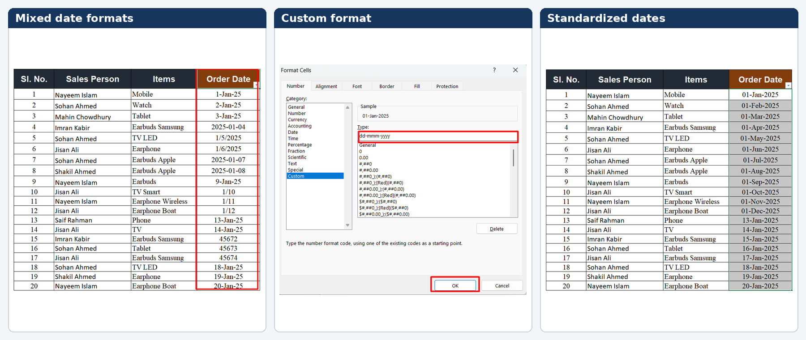

**Key Benefit:** Creates a uniform, readable date format across the entire dataset.

---

## 8. Identifying and Removing Duplicates

**Problem:** Duplicate records inflate totals and skew analysis.

**Solution:** Use **Conditional Formatting** to highlight duplicates, then use **Remove Duplicates**.

**Steps:**
1. Select data → **Home** → **Conditional Formatting** → **Highlight Cells Rules** → **Duplicate Values**.
2. Review highlighted rows.
3. Go to **Data** → **Remove Duplicates** → Select relevant columns → **OK**.

**Screenshot:**

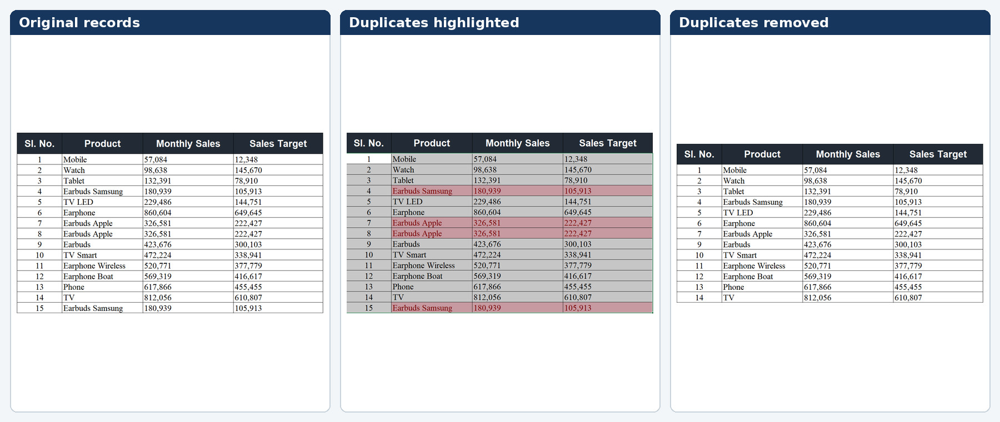

**Key Benefit:** Quickly cleans data by retaining only unique records.

---

## 9. Clearing Inconsistent Formatting

**Problem:** Data imported from multiple sources has mixed colors, bold text, font sizes, and alignments.

**Solution:** Select all data and use **Clear Formats**.

**Steps:**
1. Select the entire dataset.
2. Go to **Home** → **Editing** → **Clear** → **Clear Formats**.

**Screenshot:**

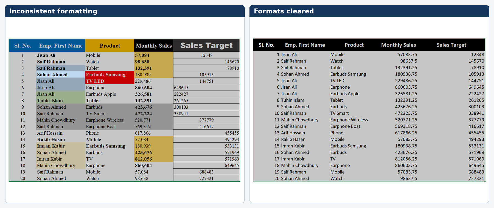

**Key Benefit:** Strips all manual formatting, leaving clean, uniform raw data.

---

## 10. Cleaning Names with TRIM and PROPER

**Problem:** Names have irregular spacing and inconsistent capitalization (e.g., `NayeEm    Islam`, `Sohan AhMed`).

**Solution:** Combine `TRIM` and `PROPER` to remove extra spaces and standardize capitalization.

**Formula Used:**
```excel
=TRIM(PROPER(B3))
```

**Screenshot:**

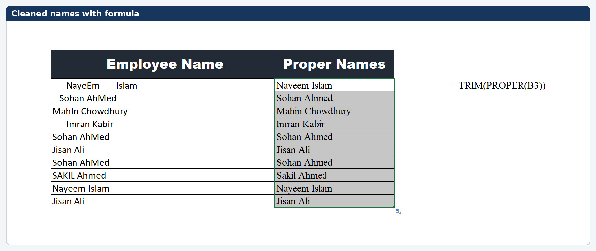

**Key Benefit:** Converts messy input into clean, professional title-case names with single spaces.

---

## 11. Reshaping Unstacked Sales Records

**Problem:** Data is stacked vertically in repeating blocks (e.g., 5 rows = 1 record) instead of horizontal columns.

**Solution:** Use the `WRAPROWS` function (Excel 365) to convert vertical stacks into rows.

**Formula Used:**
```excel
=WRAPROWS(B3:B62, 5, "")
```

**Screenshot:**

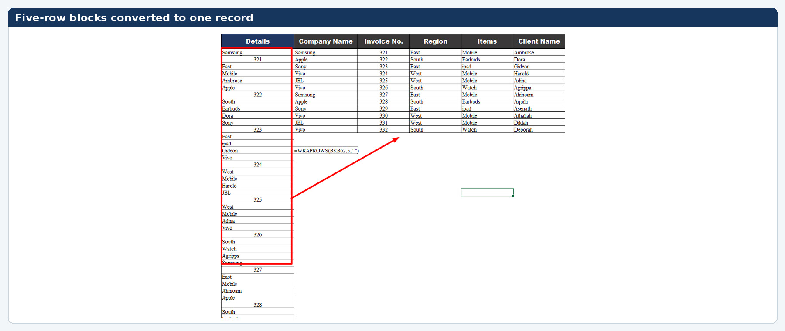

**Key Benefit:** Instantly transforms stacked/vertical data into a standard tabular format.

---

## 12. Reshaping Stacked Country Details

**Problem:** Country information is stacked in 4-row blocks (Name, Capital, Currency, Continent) in a single column.

**Solution:** Use `WRAPROWS` or manual copy-transpose techniques to convert each 4-row block into a single row with 4 columns.

**Screenshot:**

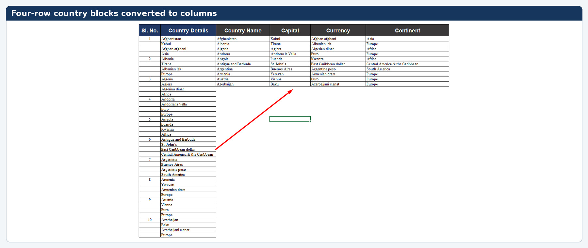

**Key Benefit:** Makes geographic datasets queryable and sortable by individual attributes.

---

## 13. Replacing Unwanted Characters in Names

**Problem:** Names contain stray punctuation: dots (`.`), commas (`,`), underscores (`_`) — e.g., `Nayeem .Islam`, `Soh.an Ahmed`.

**Solution:** Use **Find and Replace** (`Ctrl + H`) with wildcards or the `SUBSTITUTE` function.

**Steps:**
1. Select the name column.
2. Press `Ctrl + H`.
3. In "Find what", enter the unwanted character (e.g., `.`).
4. Leave "Replace with" blank → Click **Replace All**.

**Screenshot:**

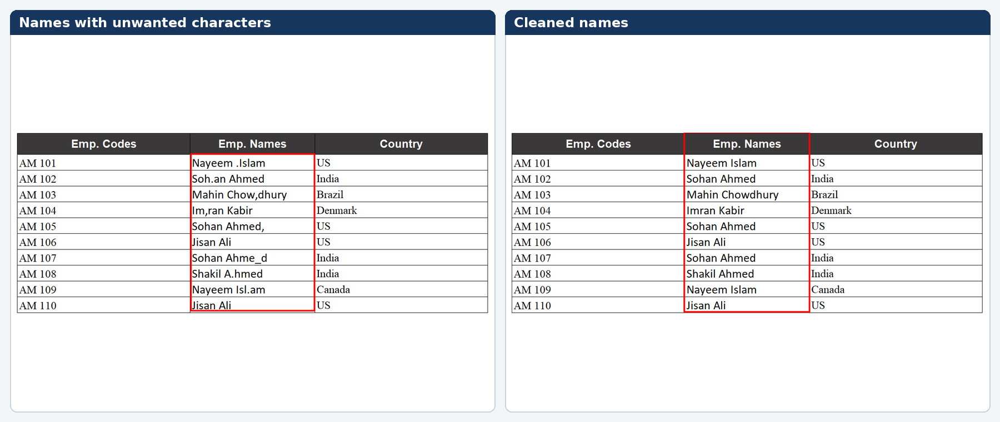

**Key Benefit:** Cleans names by stripping non-alphabetic characters in bulk.

---

## 14. Reordering Month Columns Chronologically

**Problem:** Monthly sales data columns are arranged alphabetically (`Apr`, `Aug`, `Dec`, `Feb`...) instead of chronologically.

**Solution:** Manually drag columns or use a helper row with month numbers to sort columns into `Jan` → `Dec` order.

**Screenshot:**

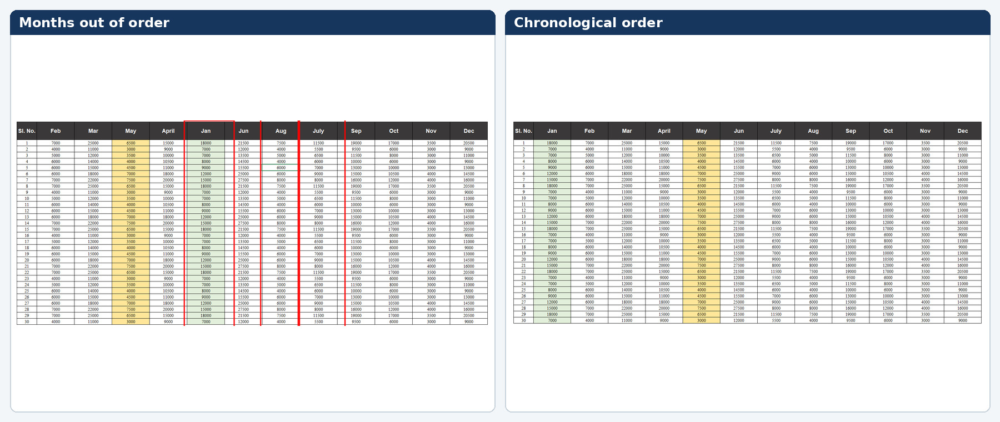

**Key Benefit:** Enables proper time-series analysis and trend visualization.

---

## 15. Standardizing Text Case

**Problem:** Names appear in mixed cases: uppercase, lowercase, and proper case.

**Solution:** Use Excel text functions to enforce consistent casing.

| Case | Formula |
|------|---------|
| Upper Case | `=UPPER(B5)` |
| Lower Case | `=LOWER(B5)` |
| Proper Case | `=PROPER(B5)` |

**Screenshot:**

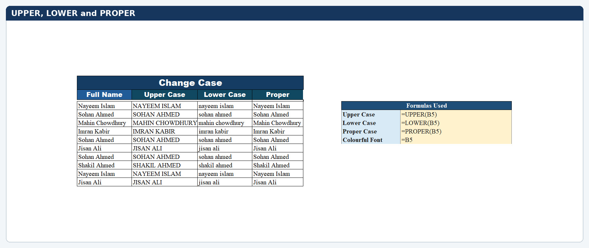

**Key Benefit:** Standardizes text for professional reporting and deduplication.

---

## 16. Combining Name Components

**Problem:** Title, first name, and last name are in separate columns and need to be merged.

**Solution:** Use the concatenation operator (`&`) with spaces.

**Formula Used:**
```excel
=B5&" "&C5&" "&D5
```

**Screenshot:**

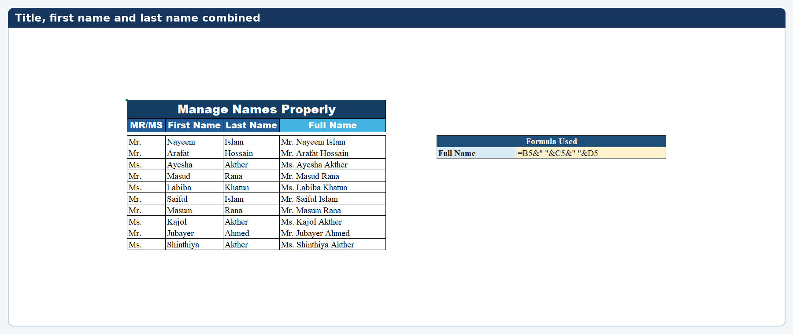

**Key Benefit:** Creates a single full-name column from fragmented components.

---

## 17. Extracting Initials, First and Last Name

**Problem:** A full name with a title (e.g., `Mr.Nayeem Islam`) needs to be split into Initials, First Name, and Last Name.

**Formulas Used:**

| Component | Formula |
|-----------|---------|
| Initials | `=LEFT(B5,FIND(".",B5))` |
| First Name | `=MID(B5,FIND(".",B5)+1,FIND(" ",B5)-FIND(".",B5)-1)` |
| Last Name | `=RIGHT(B5,LEN(B5)-FIND(" ",B5))` |

**Screenshot:**

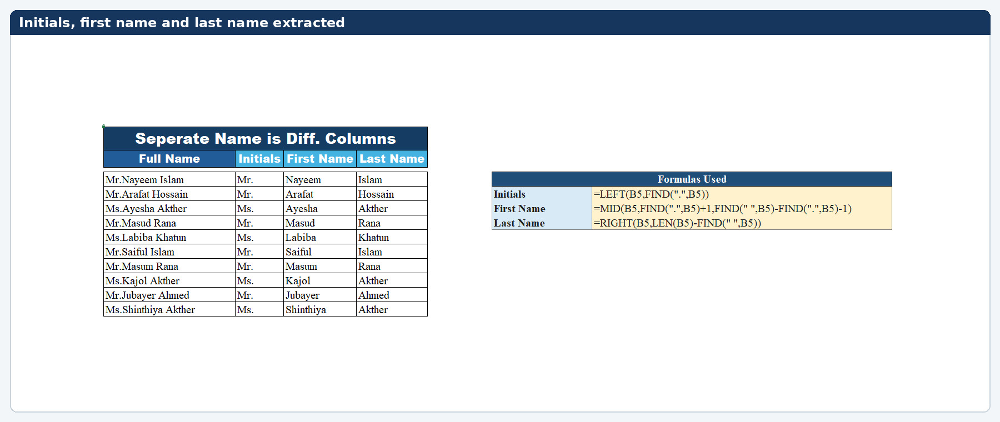

**Key Benefit:** Precisely parses structured names using position-based text functions.

---

## 18. Building Dynamic Sentences

**Problem:** Need to generate readable sentences from raw data cells.

**Solution:** Concatenate static text with cell references.

**Examples:**

| Sentence Type | Formula |
|---------------|---------|
| Introductory | `="I am "&B5` |
| Name + Age | `=B5&" is "&C5&" years old"` |

**Screenshot:**

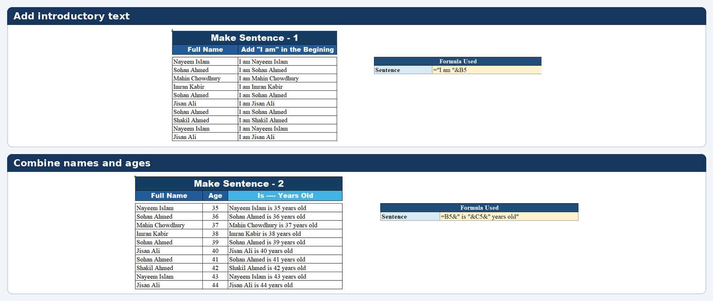

**Key Benefit:** Automates the creation of narrative text for reports or mail merges.

---

## 19. Reversing First and Last Names

**Problem:** Names are stored as `First Last` but need to be displayed as `Last First`.

**Solution:** Extract the last name and first name, then concatenate them in reverse order.

**Formula Used:**
```excel
=RIGHT(B5,LEN(B5)-FIND(" ",B5))&" "&LEFT(B5,FIND(" ",B5)-1)
```

**Screenshot:**


**Key Benefit:** Reorders names for alphabetical sorting by surname or formal addressing.

---

## 20. Generating Email IDs in Bulk

**Problem:** Need to create company email addresses from a list of employee names.

**Solution:** Convert names to lowercase, replace spaces with dots, and append the domain.

**Formula Used:**
```excel
=LOWER(SUBSTITUTE(B5," ","."))&"@gmail.com"
```

**Example:** `Nayeem Islam` → `nayeem.islam@gmail.com`

**Screenshot:**

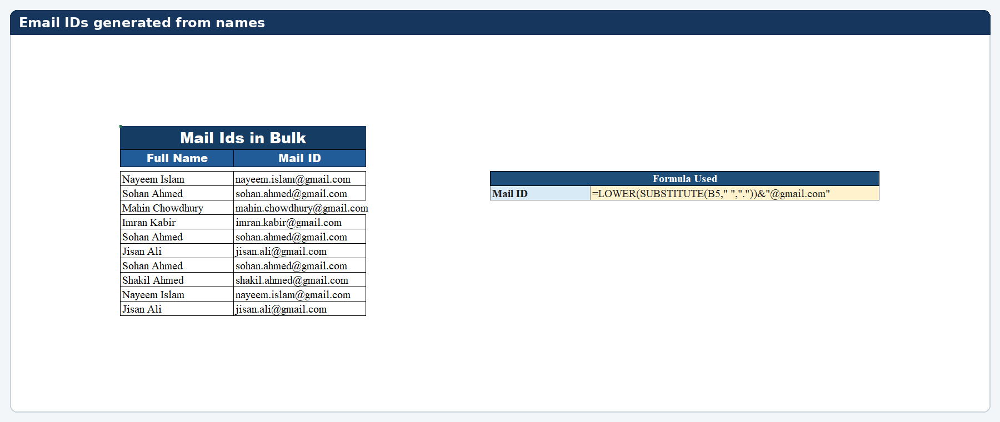

**Key Benefit:** Generates hundreds of standardized email IDs instantly.

---

## 21. Extracting Date Components and Reformatting

**Problem:** Need to isolate Day, Month, and Year from a date, or convert it to a specific text format.

**Formulas Used:**

| Component | Formula |
|-----------|---------|
| Day | `=DAY(B5)` |
| Month | `=MONTH(B5)` |
| Year | `=YEAR(B5)` |
| Custom Text Format | `=TEXT(B5,"mm/dd/yy")` |

**Screenshot:**

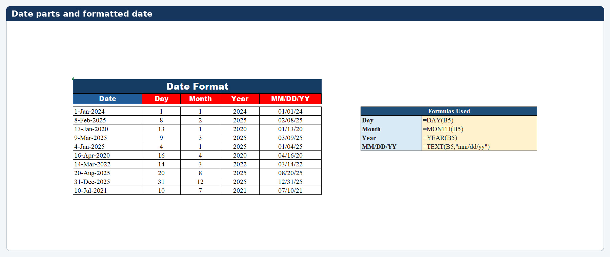

**Key Benefit:** Enables date-based filtering, grouping, and custom formatting.

---

## 22. Adding Country Codes to Phone Numbers

**Problem:** Phone numbers need international country codes prepended for a standardized contact list.

**Solution:**

**Method A — Formula:**
```excel
=C5&TEXT(B5,"0")
```

**Method B — Flash Fill:**
1. In the first cell, manually type the country code + number (e.g., `+91 98982343`).
2. Press `Ctrl + E` to auto-fill the pattern down.

**Screenshot:**

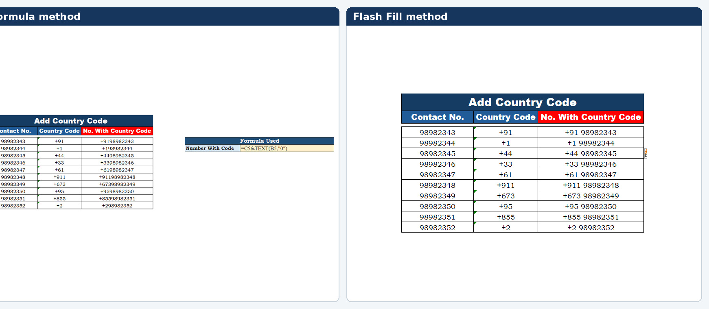

**Key Benefit:** Prepares phone numbers for international CRM systems and dialing.

---

## Summary

| # | Technique | Primary Tool / Function |
|---|-----------|------------------------|
| 1 | Handling Calculation Errors | `IFERROR` |
| 2 | Preserving Long Order IDs | Format Cells → Number |
| 3 | Splitting Full Names | Flash Fill (`Ctrl + E`) |
| 4 | Parsing Combined Details | Flash Fill / Text to Columns |
| 5 | Removing Blank Rows | Go To Special → Blanks |
| 6 | Filling Missing Values | `Ctrl + Enter` |
| 7 | Standardizing Dates | Custom Format `dd-mmm-yyyy` |
| 8 | Removing Duplicates | Conditional Formatting + Remove Duplicates |
| 9 | Clearing Formatting | Clear Formats |
| 10 | Cleaning Names | `TRIM` + `PROPER` |
| 11 | Reshaping Unstacked Data | `WRAPROWS` |
| 12 | Reshaping Stacked Data | `WRAPROWS` |
| 13 | Replacing Characters | Find & Replace / `SUBSTITUTE` |
| 14 | Reordering Months | Manual / Custom Sort |
| 15 | Standardizing Text Case | `UPPER` / `LOWER` / `PROPER` |
| 16 | Combining Names | `&` (Concatenation) |
| 17 | Extracting Name Parts | `LEFT` / `MID` / `RIGHT` / `FIND` |
| 18 | Building Sentences | `&` (Concatenation) |
| 19 | Reversing Names | `RIGHT` + `LEFT` + `FIND` |
| 20 | Generating Emails | `LOWER` + `SUBSTITUTE` |
| 21 | Extracting Date Parts | `DAY` / `MONTH` / `YEAR` / `TEXT` |
| 22 | Adding Country Codes | `&` + `TEXT` or Flash Fill |

---

*All examples were created and documented as part of the Data Analytics Portfolio.*
