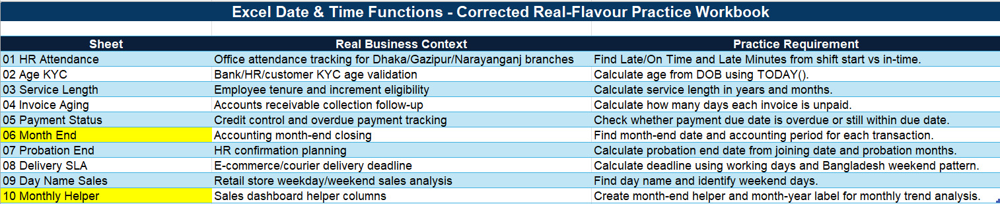
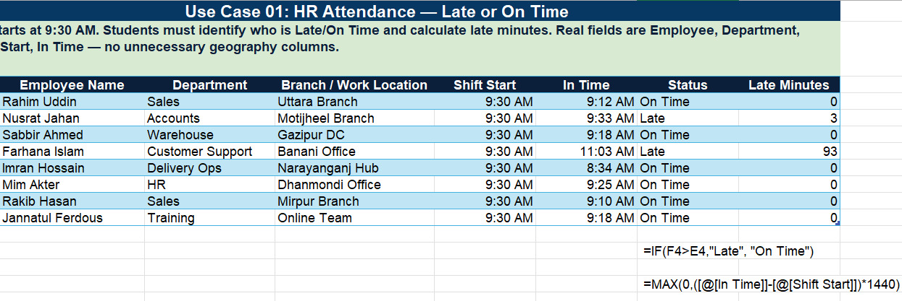
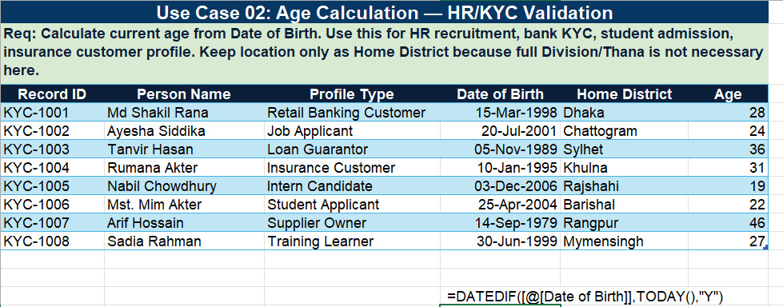
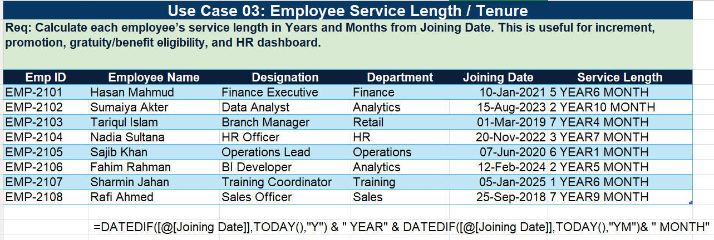
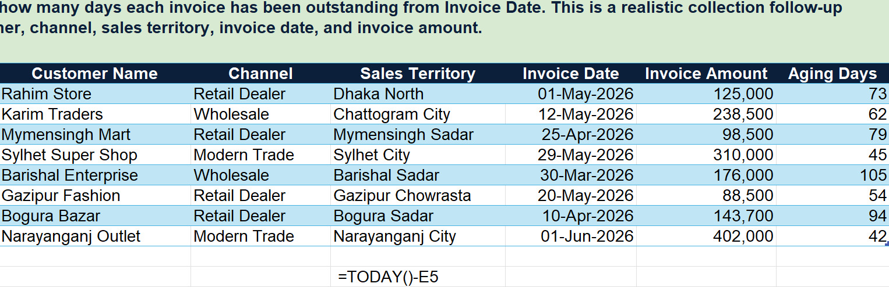
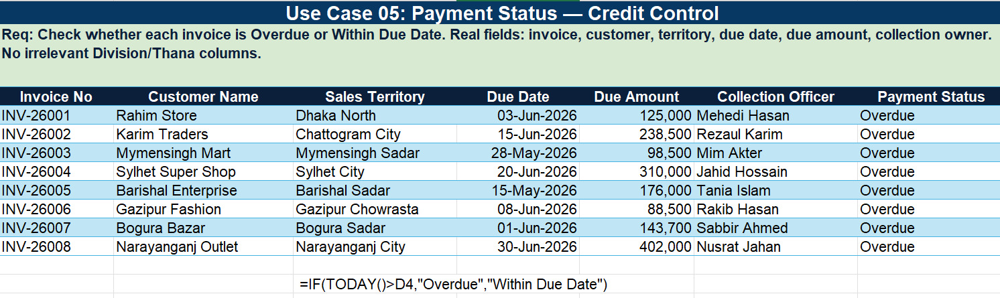
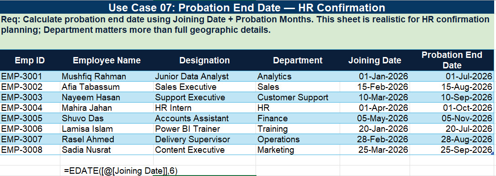
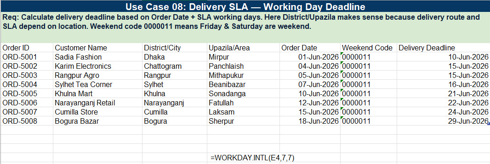
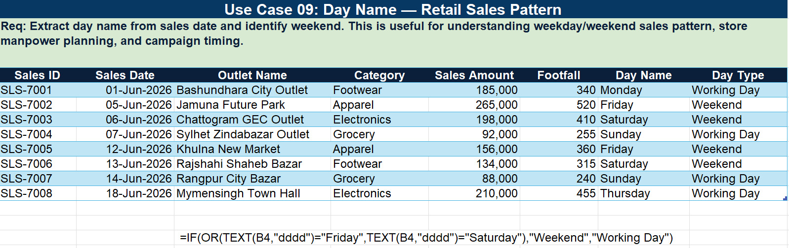
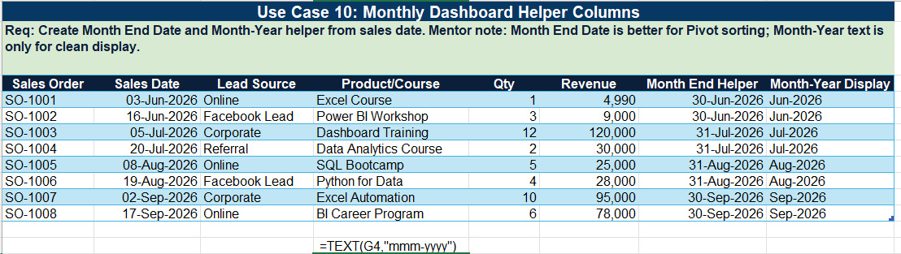

# Excel Date & Time Functions — Real-World Business Use Cases

A practical workbook demonstrating **10 real-world business scenarios** where Excel Date & Time functions solve everyday operational problems across HR, Finance, Sales, and Logistics. Each use case includes the exact formula, business context, and a visual screenshot.

---

## Table of Contents

1. [HR Attendance — Late or On Time](#use-case-01-hr-attendance--late-or-on-time)
2. [Age Calculation — HR & KYC Validation](#use-case-02-age-calculation--hr--kyc-validation)
3. [Employee Service Length & Tenure](#use-case-03-employee-service-length--tenure)
4. [Invoice Aging — Collection Follow-up](#use-case-04-invoice-aging--collection-follow-up)
5. [Payment Status — Credit Control](#use-case-05-payment-status--credit-control)
6. [Month End — Accounting Closing *(Overview Only)*](#use-case-06-month-end--accounting-closing)
7. [Probation End Date — HR Confirmation](#use-case-07-probation-end-date--hr-confirmation)
8. [Delivery SLA — Working Day Deadline](#use-case-08-delivery-sla--working-day-deadline)
9. [Day Name — Retail Sales Pattern](#use-case-09-day-name--retail-sales-pattern)
10. [Monthly Dashboard Helper Columns](#use-case-10-monthly-dashboard-helper-columns)

---

## Workbook Index & Business Context Overview

| Sheet | Real Business Context | Practice Requirement |
|-------|----------------------|---------------------|
| **01** HR Attendance | Office attendance tracking for Dhaka/Gazipur/Narayanganj branches | Find Late/On Time and Late Minutes from shift start vs in-time |
| **02** Age KYC | Bank/HR/customer KYC age validation | Calculate age from DOB using `TODAY()` |
| **03** Service Length | Employee tenure and increment eligibility | Calculate service length in years and months |
| **04** Invoice Aging | Accounts receivable collection follow-up | Calculate how many days each invoice is unpaid |
| **05** Payment Status | Credit control and overdue payment tracking | Check whether payment due date is overdue or still within due date |
| **06** Month End | Accounting month-end closing | Find month-end date and accounting period for each transaction |
| **07** Probation End | HR confirmation planning | Calculate probation end date from joining date and probation months |
| **08** Delivery SLA | E-commerce/courier delivery deadline | Calculate deadline using working days and Bangladesh weekend pattern |
| **09** Day Name Sales | Retail store weekday/weekend sales analysis | Find day name and identify weekend days |
| **10** Monthly Helper | Sales dashboard helper columns | Create month-end helper and month-year label for monthly trend analysis |

**Screenshot:**



---

## Use Case 01: HR Attendance — Late or On Time

**Business Context:** Office attendance tracking for Dhaka/Gazipur/Narayanganj branches. Shift starts at 9:30 AM.

**Objective:** Identify who is Late or On Time and calculate how many minutes late each employee is.

### Dataset Columns
`Employee Name` | `Department` | `Branch / Work Location` | `Shift Start` | `In Time` | `Status` | `Late Minutes`

### Formulas Used

| Column | Formula | Explanation |
|--------|---------|-------------|
| **Status** | `=IF(F4>E4,"Late", "On Time")` | Compares In Time against Shift Start |
| **Late Minutes** | `=MAX(0,([@[In Time]]-[@Shift Start])*1440)` | Calculates minutes late; returns 0 if on time or early. Multiplies by 1440 to convert Excel's day fraction to minutes |

**Screenshot:**



**Key Benefit:** Automates attendance monitoring across multiple branches with zero manual calculation.

---

## Use Case 02: Age Calculation — HR & KYC Validation

**Business Context:** Bank/HR/customer KYC age validation for recruitment, student admission, insurance customer profiling.

**Objective:** Calculate current age from Date of Birth.

### Dataset Columns
`Record ID` | `Person Name` | `Profile Type` | `Date of Birth` | `Home District` | `Age`

### Formula Used

```excel
=DATEDIF([@[Date of Birth]],TODAY(),"Y")
```

**Screenshot:**



**Key Benefit:** Provides accurate, auto-updating age calculations for KYC compliance, HR screening, and eligibility checks.

---

## Use Case 03: Employee Service Length & Tenure

**Business Context:** Employee tenure and increment eligibility tracking for HR dashboards.

**Objective:** Calculate each employee's service length in **Years** and **Months** from their Joining Date.

### Dataset Columns
`Emp ID` | `Employee Name` | `Designation` | `Department` | `Joining Date` | `Service Length`

### Formula Used

```excel
=DATEDIF([@[Joining Date]],TODAY(),"Y") & " YEAR" & DATEDIF([@[Joining Date]],TODAY(),"YM") & " MONTH"
```

**Screenshot:**



**Key Benefit:** Powers increment, promotion, gratuity, and benefit eligibility decisions with precise tenure data.

---

## Use Case 04: Invoice Aging — Collection Follow-up

**Business Context:** Accounts receivable collection follow-up. Tracks how long each invoice has been outstanding.

**Objective:** Calculate the number of days each invoice remains unpaid from the Invoice Date.

### Dataset Columns
`Customer Name` | `Channel` | `Sales Territory` | `Invoice Date` | `Invoice Amount` | `Aging Days`

### Formula Used

```excel
=TODAY()-E5
```

**Screenshot:**



**Key Benefit:** Enables prioritized collection efforts by identifying the oldest outstanding invoices.

---

## Use Case 05: Payment Status — Credit Control

**Business Context:** Credit control and overdue payment tracking.

**Objective:** Check whether each invoice is **Overdue** or **Within Due Date** by comparing the Due Date against today.

### Dataset Columns
`Invoice No` | `Customer Name` | `Sales Territory` | `Due Date` | `Due Amount` | `Collection Officer` | `Payment Status`

### Formula Used

```excel
=IF(TODAY()>D4,"Overdue","Within Due Date")
```

**Screenshot:**



**Key Benefit:** Automates credit risk monitoring and triggers follow-up workflows for collection teams.

---

## Use Case 06: Month End — Accounting Closing

**Business Context:** Accounting month-end closing and period reconciliation.

**Objective:** Find the month-end date and accounting period for each transaction.

**Note:** This use case is included in the workbook index. The core function used is `EOMONTH(date, 0)` to return the last day of the month for any given transaction date.

**Key Benefit:** Standardizes financial reporting periods and ensures consistent month-end closing across all transactions.

---

## Use Case 07: Probation End Date — HR Confirmation

**Business Context:** HR confirmation planning. Calculate when an employee completes their probation period.

**Objective:** Determine the probation end date using Joining Date + Probation Months (e.g., 6 months).

### Dataset Columns
`Emp ID` | `Employee Name` | `Designation` | `Department` | `Joining Date` | `Probation End Date`

### Formula Used

```excel
=EDATE([@[Joining Date]],6)
```

**Screenshot:**



**Key Benefit:** Automates HR confirmation scheduling by calculating exact probation completion dates.

---

## Use Case 08: Delivery SLA — Working Day Deadline

**Business Context:** E-commerce/courier delivery deadline calculation. Route and SLA depend on location.

**Objective:** Calculate the delivery deadline based on Order Date + SLA working days, accounting for Bangladesh's Friday & Saturday weekend.

### Dataset Columns
`Order ID` | `Customer Name` | `District/City` | `Upazila/Area` | `Order Date` | `Weekend Code` | `Delivery Deadline`

### Formula Used

```excel
=WORKDAY.INTL(E4,7,7)
```

> **Weekend Code:** `0000011` means **Friday & Saturday** are the weekend (Bangladesh standard). The third argument `7` in `WORKDAY.INTL` specifies Friday-Saturday weekend.

**Screenshot:**



**Key Benefit:** Calculates accurate delivery deadlines excluding local weekends, ensuring realistic SLA commitments.

---

## Use Case 09: Day Name — Retail Sales Pattern

**Business Context:** Retail store weekday/weekend sales analysis, manpower planning, and campaign timing.

**Objective:** Extract the day name from the sales date and classify each day as **Weekend** or **Working Day**.

### Dataset Columns
`Sales ID` | `Sales Date` | `Outlet Name` | `Category` | `Sales Amount` | `Footfall` | `Day Name` | `Day Type`

### Formula Used

```excel
=IF(OR(TEXT(B4,"dddd")="Friday",TEXT(B4,"dddd")="Saturday"),"Weekend","Working Day")
```

**Screenshot:**



**Key Benefit:** Reveals weekday vs. weekend sales patterns to optimize staffing, inventory, and promotional campaigns.

---

## Use Case 10: Monthly Dashboard Helper Columns

**Business Context:** Sales dashboard helper columns for monthly trend analysis and pivot table grouping.

**Objective:** Create a **Month End Date** helper and a **Month-Year** text label from the sales date.

### Dataset Columns
`Sales Order` | `Sales Date` | `Lead Source` | `Product/Course` | `Qty` | `Revenue` | `Month End Helper` | `Month-Year Display`

### Formulas Used

| Column | Formula | Explanation |
|--------|---------|-------------|
| **Month End Helper** | `=EOMONTH([@[Sales Date]],0)` | Returns the last day of the month for pivot sorting |
| **Month-Year Display** | `=TEXT([@[Sales Date]],"mmm-yyyy")` | Creates a clean text label like `Jun-2026` for display |

**Screenshot:**



**Key Benefit:** Month End Date ensures correct chronological sorting in PivotTables; Month-Year text provides clean dashboard labels.

---

## Summary of Functions Used

| Function | Use Case(s) | Purpose |
|----------|-------------|---------|
| `TODAY()` | 01, 02, 03, 04, 05 | Returns current date for dynamic calculations |
| `DATEDIF()` | 02, 03 | Calculates difference between two dates in years/months/days |
| `IF()` | 01, 05, 09 | Logical branching for status/classification |
| `MAX()` | 01 | Ensures non-negative late minutes |
| `EDATE()` | 07 | Adds/subtracts months from a date |
| `WORKDAY.INTL()` | 08 | Calculates working days with custom weekends |
| `TEXT()` | 09, 10 | Formats dates as text (day names, month-year labels) |
| `EOMONTH()` | 06, 10 | Returns last day of the month |
| `OR()` | 09 | Combines multiple conditions |

---

## Core Concepts

- **Date Arithmetic:** Excel stores dates as serial numbers (day fractions), enabling math operations like subtraction for aging calculations.
- **Structured References:** `[@ColumnName]` syntax makes formulas robust and auto-expand with tables.
- **Custom Weekends:** `WORKDAY.INTL` supports region-specific weekend patterns (e.g., Friday-Saturday for Bangladesh).
- **Helper Columns:** Month-end and month-year columns simplify PivotTable grouping and dashboard formatting.

---

*All examples were created and documented as part of the Data Analytics Portfolio.*
