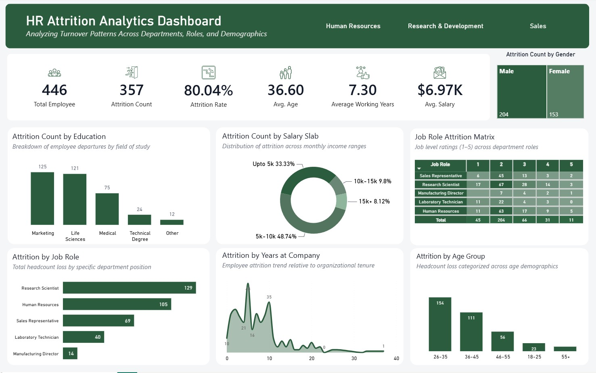

# HR Attrition Analytics Dashboard

*Analyzing Turnover Patterns Across Departments, Roles, and Demographics*

## 📌 Overview

This project is an interactive **Power BI dashboard** built to help an HR / People Analytics team understand *why employees leave* and *where attrition is concentrated* — by department, job role, salary band, tenure, and demographic group. It turns a raw employee-record dataset into a decision-ready report that HR leadership can use to prioritize retention efforts.

## 🎯 Business Requirements

The dashboard was designed to answer the following stakeholder questions:

1. What is the organization's overall headcount and attrition rate, and how does it break down by gender?
2. Which departments and job roles are losing the most employees?
3. Does education background (field of study) correlate with attrition?
4. How does attrition vary by income / salary slab — are lower earners leaving more often?
5. How does attrition trend against **tenure** (years at the company)?
6. Which age groups are most at risk of leaving?
7. Can HR compare job-level satisfaction ratings across roles and departments in one view (Job Role Attrition Matrix)?

## 🗂️ Dataset

The report is powered by `HR_Data.xlsx`, a demo employee-attrition dataset structured for Power BI (fields and scale are consistent with the widely used IBM HR Analytics Employee Attrition sample data, reshaped here into a star schema).

| Table | Rows | Description |
|---|---|---|
| `HR_Data` | 1,470 employees | Fact table — demographics, compensation, satisfaction scores, and tenure metrics (38 columns) |
| `Education` | 6 | Education field lookup (Marketing, Life Sciences, Medical, Technical Degree, Human Resources, Other) |
| `Jobs` | 9 | Job role lookup (Sales Representative, Research Scientist, Manufacturing Director, Laboratory Technician, Human Resources, etc.) |
| `Departments` | 3 | Department lookup (Research & Development, Sales, Human Resources) |

**Key fields in `HR_Data`:** `EmpID`, `Age` / `AgeGroup`, `Attrition`, `BusinessTravel`, `Department`, `DistanceFromHome`, `Education`, `Gender`, `JobRole`, `JobLevel`, `JobSatisfaction`, `JobInvolvement`, `EnvironmentSatisfaction`, `MaritalStatus`, `MonthlyIncome`, `SalarySlab`, `OverTime`, `PerformanceRating`, `StockOptionLevel`, `TotalWorkingYears`, `YearsAtCompany`, `YearsInCurrentRole`, `YearsSinceLastPromotion`, `YearsWithCurrManager`, and more.

> This is a **demo / practice dataset** used for portfolio purposes only — it does not represent a real organization.

## 🧩 Data Model

A star schema with `HR_Data` as the central fact table, joined to three dimension/lookup tables (`Education`, `Jobs`, `Departments`) and supported by a dedicated `Calculation Measure Table` holding the report's DAX measures:

- **Attrition Count**
- **Attrition Rate**
- **Average Working Years**

## 📊 Dashboard Highlights

The single-page report includes:

- **KPI cards:** Total Employees, Attrition Count, Attrition Rate, Average Age, Average Working Years, Average Salary
- **Attrition Count by Gender** — stacked comparison of male vs. female attrition
- **Attrition Count by Education** — departures broken down by field of study
- **Attrition Count by Salary Slab** — donut chart of attrition share by monthly income band
- **Job Role Attrition Matrix** — heat-mapped table of job-level ratings (1–5) across every department role
- **Attrition by Job Role** — total headcount loss per position
- **Attrition by Years at Company** — turnover trend against organizational tenure
- **Attrition by Age Group** — headcount loss across age demographics
- Top-level filters/tabs for **Human Resources, Research & Development, and Sales**

### Key Insights (from the report shown above)

- **446** employees / **357** attritions captured in the current view (**80.04%** attrition rate), average age **36.6**, average tenure **7.3 years**, average salary **$6.97K**
- Attrition skews male (**204**) vs. female (**153**)
- **Marketing** (125) and **Life Sciences** (121) education backgrounds account for the largest share of departures
- Nearly half of attrition (**48.74%**) falls in the **$5k–$10k** monthly salary slab, and **33.33%** in the lowest (**Upto $5k**) band
- **Research Scientist** (129) and **Human Resources** (105) are the job roles with the highest attrition counts
- Turnover spikes sharply in the **first 5–10 years** of tenure, then tapers off
- The **26–35** age group accounts for the most departures (154), followed by 36–45 (111)

## 🛠️ Tools Used

- **Power BI Desktop** — data modeling, DAX measures, report design
- **Excel** — source data (`HR_Data.xlsx`)

## 📁 Repository Contents

| File | Description |
|---|---|
| `HR Attrition Project 1.pbix` | Power BI report file (open in Power BI Desktop) |
| `HR_Data.xlsx` | Source dataset (fact + lookup tables) |
| `Dashboard.jpg` | Dashboard screenshot |
| `Data Model.jpg` | Data model / relationships screenshot |
| `README.md` | Project documentation |

## 🚀 How to Use

1. Download `HR Attrition Project 1.pbix` and `HR_Data.xlsx` from this folder
2. Open the `.pbix` file in **Power BI Desktop**
3. If prompted, point the data source to your local copy of `HR_Data.xlsx`
4. Explore the report using the department tabs and visual-level filters

