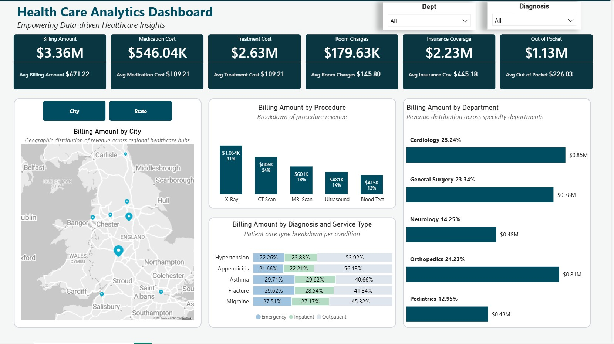

# 🏥 Health Care Analytics Dashboard

**Empowering Data-driven Healthcare Insights**

An interactive Power BI dashboard analyzing patient visits, billing, insurance coverage, and department performance across a network of healthcare providers.



---

## 📑 Table of Contents

- [Business Requirements](#-business-requirements)
- [Dashboard Overview](#-dashboard-overview)
- [Data Model](#-data-model)
- [Dataset Overview](#-dataset-overview)
- [Key Insights](#-key-insights)
- [Tools & Technologies](#-tools--technologies)
- [Repository Structure](#-repository-structure)
- [Power BI File](#-power-bi-file)

---

## 📋 Business Requirements

Hospital administration and finance stakeholders needed a single view into billing performance and patient care patterns to support budgeting and operational decisions. The dashboard was built to answer:

1. **Revenue & Cost Breakdown** — What is the total billing amount, and how does it split across medication, treatment, and room charges?
2. **Insurance vs. Patient Burden** — How much of total billing is covered by insurance versus paid out of pocket by patients?
3. **Department Performance** — Which departments (Cardiology, General Surgery, Neurology, Orthopedics, Pediatrics) generate the most billing revenue?
4. **Procedure Profitability** — Which procedures (X-Ray, CT Scan, MRI Scan, Ultrasound, Blood Test) contribute most to revenue?
5. **Diagnosis & Care Setting** — How does billing differ by diagnosis and by service type (Emergency, Inpatient, Outpatient)?
6. **Geographic Distribution** — Where are patients and billing revenue concentrated, by city and state?
7. **Self-Service Filtering** — Stakeholders can slice all of the above by Department and Diagnosis to drill into specific areas of the business.

---

## 📊 Dashboard Overview


The dashboard delivers:
- **KPI cards** for Billing Amount, Medication Cost, Treatment Cost, Room Charges, Insurance Coverage, and Out of Pocket cost (with averages for each)
- A **map visual** for billing distribution by City / State
- **Bar charts** for billing amount by Procedure and by Department
- A **stacked breakdown** of billing amount by Diagnosis and Service Type (Emergency / Inpatient / Outpatient)
- **Dept** and **Diagnosis** slicers for interactive filtering

---

## 🗂 Data Model


The model follows a star-schema pattern: a central **visits** fact table connects to **patients**, **providers**, **department**, **diagnose**, **procedures**, and **insurance** dimension tables, with **patients** linking further to **cities** for geography and a **Date Table** supporting time intelligence. A dedicated **All Calculation Measures** table holds the DAX measures (Avg Billing Amount, Avg Insurance Coverage, Avg Length of Stay, Avg Medication Cost, Avg Out of Pocket, Avg Room Charges, Avg Satisfaction Score, Avg Treatment Cost, department %, Procedures %, Total Billing Amount, Total Insurance Coverage, and more).

---

## 🗃 Dataset Overview

The project uses 8 CSV tables. Previews below show the first 5 rows of each.

### `patients.csv` (4,973 rows)
| Patient ID | Patient Name | Gender | Age | City ID | Race |
|---|---|---|---|---|---|
| 1 | Morgan Thompson | Male | 18 | 10 | Hispanic |
| 2 | Avery Anderson | Male | 19 | 27 | Hispanic |
| 3 | Aisha Khan | Female | 20 | 10 | Asian |
| 4 | Adanna Eze | Male | 20 | 9 | Black |
| 5 | Haruto Chen | Male | 20 | 9 | Asian |

### `visits.csv` (5,000 rows)
| Date of Visit | Patient ID | Provider ID | Department ID | Diagnosis ID | Procedure ID | Insurance ID | Service Type | Treatment Cost | Medication Cost | Follow-Up Visit Date | Satisfaction Score | Referral Source | Emergency Visit | Payment Status | Room Type | Insurance Coverage | Room Charges (daily) |
|---|---|---|---|---|---|---|---|---|---|---|---|---|---|---|---|---|---|
| 1/1/2024 | 4928 | 1 | 2 | 1 | 2 | 1 | Outpatient | 841 | 21 | 1/9/2024 | 7 | Self-Referral | No | Paid | N/A | 603.4 | 0 |
| 1/1/2024 | 1083 | 4 | 1 | 4 | 2 | 2 | Inpatient | 535 | 27 | — | 8 | Emergency | No | Paid | Semi-Private Room | 414.4 | 30 |
| 1/1/2024 | 4534 | 4 | 2 | 1 | 2 | 2 | Inpatient | 422 | 70 | — | 7 | Self-Referral | No | Paid | Semi-Private Room | 365.4 | 30 |
| 1/1/2024 | 4504 | 4 | 1 | 4 | 4 | 3 | Outpatient | 811 | 136 | 1/20/2024 | 5 | Self-Referral | No | Paid | N/A | — | 0 |
| 1/1/2024 | 331 | 4 | 2 | 1 | 2 | 3 | Outpatient | 682 | 131 | 1/30/2024 | 5 | Physician Referral | No | Paid | N/A | — | 0 |

### `providers.csv` (5 rows)
| Provider ID | Provider Name | Gender | Nationality | Age |
|---|---|---|---|---|
| 1 | Dr. Olu Abisola | Male | Nigerian | 37 |
| 4 | Dr. Ravi Patel | Male | Indian | 45 |
| 2 | Dr. Johnson Grek | Male | European | 50 |
| 3 | Dr. Emma Jones | Female | European | 34 |
| 5 | Dr. Sade Kikiola | Female | Nigerian | 35 |

### `cities.csv` (40 rows)
| City ID | City | State |
|---|---|---|
| 40 | Sheffield | Wales |
| 9 | Edinburgh | England |
| 2 | Birmingham | Northern Ireland |
| 13 | Glasgow | England |
| 37 | Sheffield | England |

### `department.csv` (5 rows)
| Department ID | Department |
|---|---|
| 2 | General Surgery |
| 1 | Cardiology |
| 3 | Neurology |
| 5 | Pediatrics |
| 4 | Orthopedics |

### `diagnose.csv` (5 rows)
| Diagnosis ID | Diagnosis |
|---|---|
| 1 | Appendicitis |
| 4 | Hypertension |
| 2 | Asthma |
| 5 | Migraine |
| 3 | Fracture |

### `procedures.csv` (5 rows)
| Procedure ID | Procedure |
|---|---|
| 2 | CT Scan |
| 5 | X-Ray |
| 4 | Ultrasound |
| 1 | Blood Test |
| 3 | MRI Scan |

### `insurance.csv` (3 rows)
| Insurance ID | Insurance Provider |
|---|---|
| 1 | Aviva |
| 2 | AXA |
| 3 | Allianz |

---

## 💡 Key Insights

- **Total Billing Amount: $3.36M**, averaging **$671.22** per visit
- Cost breakdown: **Treatment Cost $2.63M**, **Medication Cost $546.04K**, **Room Charges $179.63K**
- **Insurance Coverage ($2.23M)** absorbs the majority of billing, leaving patients with **$1.13M** out of pocket (avg **$226.03**/visit)
- **Cardiology (25.24%)**, **Orthopedics (24.23%)**, and **General Surgery (23.34%)** are the top revenue-generating departments
- **X-Ray** is the leading procedure by revenue (**$1,054K, 31%**), followed by **CT Scan (24%)** and **MRI Scan (18%)**
- Across diagnoses, **Outpatient** care consistently makes up the largest share of billing, with **Emergency** and **Inpatient** splitting the remainder

---

## 🛠 Tools & Technologies

- **Power BI Desktop** — data modeling, DAX measures, and dashboard design
- **Power Query** — data transformation and cleaning
- **DAX** — calculated measures (averages, totals, percentage-of-total splits)

---

## 📁 Repository Structure

```
Health Care Analytics Dashboard/
├── Dashboard.jpg                          # Dashboard screenshot
├── Data Model.jpg                         # Star-schema data model screenshot
├── HealthCare Analytics Dashboard.pbix    # Power BI project file
├── README.md
├── cities.csv
├── department.csv
├── diagnose.csv
├── insurance.csv
├── patients.csv
├── procedures.csv
├── providers.csv
└── visits.csv
```

---

## 📦 Power BI File

The full interactive report is available here:
👉 [`HealthCare Analytics Dashboard.pbix`](./HealthCare%20Analytics%20Dashboard.pbix)

Download and open it in [Power BI Desktop](https://www.microsoft.com/en-us/power-platform/products/power-bi/desktop) to explore the report and underlying data model interactively.
