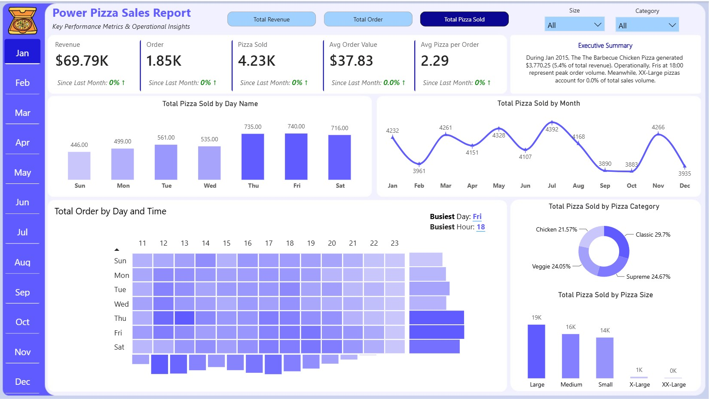

# 🍕 Power Pizza Sales Dashboard

> **Key Performance Metrics & Operational Insights** — An interactive Power BI dashboard analyzing pizza sales data across time, categories, and customer behavior patterns.

---

## 📋 Table of Contents

- [Project Overview](#project-overview)
- [Business Requirements](#business-requirements)
- [Data Sources](#data-sources)
- [Data Model](#data-model)
- [Dashboard Preview](#dashboard-preview)
- [Key Insights](#key-insights)
- [Repository Files](#repository-files)
- [Tools & Technologies](#tools--technologies)
- [Sample Data](#sample-data)

---

## 🎯 Project Overview

This project delivers a comprehensive **Power BI dashboard** that transforms raw pizza sales data into actionable business intelligence. The dashboard enables stakeholders to monitor revenue, order volume, and product performance while identifying peak operational periods and customer preferences.

**Dataset Period:** January 1, 2015 – December 31, 2015 (365 days)  
**Total Records:** 49,574 pizza items across 21,350 orders

---

## 📊 Business Requirements

The following business questions and analytical requirements were identified and addressed through the dashboard:

| # | Business Requirement | Dashboard Component |
|---|---------------------|---------------------|
| 1 | **Track overall business performance** with core KPIs | KPI Cards: Revenue, Orders, Pizza Sold, Avg Order Value, Avg Pizza/Order |
| 2 | **Analyze sales distribution by day of week** to identify peak/low days | Bar Chart: Total Pizza Sold by Day Name |
| 3 | **Monitor monthly sales trends** for seasonality insights | Line Chart: Total Pizza Sold by Month |
| 4 | **Identify peak order hours** for staffing and inventory planning | Heatmap: Total Order by Day and Time |
| 5 | **Understand product mix** by pizza category | Donut Chart: Total Pizza Sold by Pizza Category |
| 6 | **Evaluate size preferences** and their contribution to volume | Bar Chart: Total Pizza Sold by Pizza Size |
| 7 | **Provide executive summary** with automated insights | Text Box: Executive Summary |
| 8 | **Enable dynamic filtering** by month, size, and category | Slicers: Month (left nav), Size & Category (top right) |
| 9 | **Track month-over-month growth** for each KPI | KPI Cards with variance indicators |

---

## 📁 Data Sources

### 1. Pizza Sales Fact Table (`pizza_sales`)

Transactional data capturing every pizza ordered throughout 2015.

| Column | Description |
|--------|-------------|
| `pizza_id` | Unique identifier for each pizza line item |
| `order_id` | Groups multiple pizzas into a single customer order |
| `pizza_name_id` | Short code for the pizza variant and size (e.g., `hawaiian_m`) |
| `quantity` | Number of units ordered (can be >1) |
| `order_date` | Date the order was placed |
| `order_time` | Time the order was placed |
| `unit_price` | Price per individual pizza |
| `total_price` | `quantity` × `unit_price` |
| `pizza_size` | Size code: S, M, L, XL, XXL |
| `pizza_category` | Category: Classic, Chicken, Supreme, Veggie |
| `pizza_ingredients` | Full list of toppings/ingredients |
| `pizza_name` | Full display name of the pizza |

**Sample Records:**

| pizza_id | order_id | pizza_name_id | quantity | order_date | order_time | unit_price | total_price | size | category | pizza_name |
|----------|----------|---------------|----------|------------|------------|------------|-------------|------|----------|------------|
| 1 | 1 | hawaiian_m | 1 | 2015-01-01 | 11:38:36 | 13.25 | 13.25 | M | Classic | The Hawaiian Pizza |
| 2 | 2 | classic_dlx_m | 1 | 2015-01-01 | 11:57:40 | 16.00 | 16.00 | M | Classic | The Classic Deluxe Pizza |
| 3 | 2 | five_cheese_l | 1 | 2015-01-01 | 11:57:40 | 18.50 | 18.50 | L | Veggie | The Five Cheese Pizza |
| 4 | 2 | ital_supr_l | 1 | 2015-01-01 | 11:57:40 | 20.75 | 20.75 | L | Supreme | The Italian Supreme Pizza |
| 5 | 2 | mexicana_m | 1 | 2015-01-01 | 11:57:40 | 16.00 | 16.00 | M | Veggie | The Mexicana Pizza |

### 2. Date Dimension Table (`Date Table`)

Calendar dimension enabling time-intelligence analysis.

| Column | Description |
|--------|-------------|
| `Date` | Calendar date |
| `Start of the Month` | First day of the month |
| `Year` | Year (2015) |
| `Quarter` | Quarter (Q1–Q4) |
| `Year-Quarter` | Combined label (e.g., 2015-Q1) |
| `Month` | Month number (1–12) |
| `Month Name` | Month abbreviation (Jan–Dec) |
| `Week of Year` | ISO week number |
| `Week of Month` | Week number within the month |
| `Day Name` | Day of week (Mon–Sun) |
| `Day Type` | Weekday or Weekend |
| `Short Year` | Two-digit year (15) |
| `Mon-Year` | Month-Year label (e.g., Jan-15) |
| `Day Number` | Day of year |

**Sample Records:**

| Date | Start of the Month | Year | Quarter | Year-Quarter | Month | Month Name | Week of Year | Week of Month | Day Name | Day Type | Short Year | Mon-Year | Day Number |
|------|-------------------|------|---------|--------------|-------|------------|--------------|---------------|----------|----------|----------|----------|------------|
| 1/1/2015 | 1/1/2015 | 2015 | Q1 | 2015-Q1 | 1 | Jan | 1 | 1 | Thu | Weekday | 15 | Jan-15 | 5 |
| 1/2/2015 | 1/1/2015 | 2015 | Q1 | 2015-Q1 | 1 | Jan | 1 | 1 | Fri | Weekday | 15 | Jan-15 | 6 |
| 1/3/2015 | 1/1/2015 | 2015 | Q1 | 2015-Q1 | 1 | Jan | 1 | 1 | Sat | Weekend | 15 | Jan-15 | 7 |
| 1/4/2015 | 1/1/2015 | 2015 | Q1 | 2015-Q1 | 1 | Jan | 2 | 2 | Sun | Weekend | 15 | Jan-15 | 1 |
| 1/5/2015 | 1/1/2015 | 2015 | Q1 | 2015-Q1 | 1 | Jan | 2 | 2 | Mon | Weekday | 15 | Jan-15 | 2 |

---

## 🔗 Data Model

The data model follows a **star schema** design with a single fact table (`pizza_sales`) connected to a dimension table (`Date Table`).

- **Relationship:** `Date Table[Date]` → `pizza_sales[order_date]` (One-to-Many)
- **Measure Table:** `All Measures Calculations` contains DAX measures for KPIs, growth calculations, and conditional formatting
- **Parameter Table:** `KPI parameters` supports dynamic KPI selection


### Key DAX Measures

| Measure | Purpose |
|---------|---------|
| `Total Revenue` | SUM of `total_price` |
| `Total Orders` | DISTINCTCOUNT of `order_id` |
| `Total Pizza Sold` | SUM of `quantity` |
| `Avg Order Value` | `Total Revenue` ÷ `Total Orders` |
| `Avg Pizza per Order` | `Total Pizza Sold` ÷ `Total Orders` |
| `Revenue Growth MoM` | Month-over-month revenue variance |
| `Order Growth MoM` | Month-over-month order variance |

---

## 🖼️ Dashboard Preview



### Dashboard Components

1. **KPI Cards (Top Row)** — Revenue ($817.86K), Orders (21.35K), Pizza Sold (49.57K), Avg Order Value ($38.31), Avg Pizza/Order (2.32) with MoM growth indicators
2. **Month Slicer (Left Sidebar)** — Quick-filter by month (Jan–Dec)
3. **Category & Size Filters (Top Right)** — Dropdown slicers for pizza category and size
4. **Total Pizza Sold by Day Name** — Bar chart showing daily volume (Fri highest, Sun lowest)
5. **Total Pizza Sold by Month** — Line chart revealing seasonal trends (Jul peak, Sep–Oct trough)
6. **Total Order by Day and Time** — Heatmap matrix showing order density by day and hour (peak at Fri 18:00)
7. **Total Pizza Sold by Pizza Category** — Donut chart: Classic (26.9%), Supreme (25.5%), Chicken (24.0%), Veggie (24.1%)
8. **Total Pizza Sold by Pizza Size** — Bar chart: Large dominates (38.2%), followed by Medium (31.5%) and Small (29.1%)
9. **Executive Summary** — Auto-generated narrative highlighting top-performing pizza, peak hours, and size distribution

---

## 💡 Key Insights

### 📈 Performance Highlights
- **Total Revenue:** $817,860.05 across 21,350 orders
- **Average Order Value:** $38.31
- **Average Pizzas per Order:** 2.32

### 🍕 Product Insights
| Rank | Top Pizza by Revenue | Revenue |
|------|---------------------|---------|
| 1 | The Thai Chicken Pizza | $43,434.25 |
| 2 | The Barbecue Chicken Pizza | $42,768.00 |
| 3 | The California Chicken Pizza | $41,409.50 |
| 4 | The Classic Deluxe Pizza | $38,180.50 |
| 5 | The Spicy Italian Pizza | $34,831.25 |

### 📅 Temporal Patterns
- **Busiest Day:** Friday (3,538 orders)
- **Busiest Hour:** 12:00 PM (2,520 orders) — lunch rush
- **Second Peak:** 6:00 PM (2,399 orders) — dinner rush
- **Slowest Day:** Sunday (fewest orders)
- **Peak Month:** July (4,392 pizzas sold)
- **Low Months:** September (3,890) and October (3,883)

### 📦 Category & Size Distribution
| Category | Revenue Share |
|----------|--------------|
| Classic | 26.91% |
| Supreme | 25.46% |
| Chicken | 23.96% |
| Veggie | 23.68% |

| Size | Quantity Share |
|------|---------------|
| Large (L) | 38.24% |
| Medium (M) | 31.54% |
| Small (S) | 29.05% |
| X-Large (XL) | 1.11% |
| XX-Large (XXL) | 0.06% |

### 🎯 Operational Recommendations
1. **Staffing:** Increase kitchen and delivery staff on **Fridays** and during **12:00–13:00** and **17:00–19:00** hours
2. **Inventory:** Stock more **Large** and **Medium** pizzas; XL and XXL represent <2% of volume
3. **Marketing:** Run promotions in **September–October** to boost historically low sales
4. **Menu:** The Thai Chicken Pizza is the top revenue generator — consider featuring it in campaigns

---

## 📂 Repository Files

```
Power-Pizza-Sales-Dashboard/
│
├── 📊 Pizza Sales Dashboard.pbix    # Power BI report file (open in Power BI Desktop)
├── 📁 pizza_sales_excel_file.xlsx   # Source data (pizza sales + date dimension)
├── 🖼️ Dashboard.jpg                 # Full dashboard screenshot
├── 🖼️ Data Model.jpg                # Data model relationship diagram
└── 📄 README.md                     # This file
```

### File Descriptions

| File | Description |
|------|-------------|
| `Pizza Sales Dashboard.pbix` | Power BI Desktop file containing the complete report, data model, DAX measures, and visualizations |
| `pizza_sales_excel_file.xlsx` | Raw dataset with two sheets: `pizza_sales` (transactional data) and `Date Table` (calendar dimension) |
| `Dashboard.jpg` | High-resolution screenshot of the final dashboard layout |
| `Data Model.jpg` | Visual representation of the star schema and table relationships |
| `README.md` | Project documentation and business context |

---

## 🛠️ Tools & Technologies

| Tool | Purpose |
|------|---------|
| **Power BI Desktop** | Dashboard design, DAX calculations, data modeling, visualization |
| **Microsoft Excel** | Source data storage and initial data exploration |
| **DAX (Data Analysis Expressions)** | Custom measures for KPIs, time intelligence, and growth calculations |
| **Star Schema** | Optimized data model for fast aggregation and filtering |

---

## 🚀 How to Use

1. **Clone this repository** or download the files
2. **Open `Pizza Sales Dashboard.pbix`** in Power BI Desktop
3. **Explore the dashboard:**
   - Click on any month in the left sidebar to filter the entire report
   - Use the **Size** and **Category** dropdowns in the top-right to drill into specific segments
   - Hover over charts for detailed tooltips
   - Toggle between **Total Revenue**, **Total Order**, and **Total Pizza Sold** using the KPI parameter buttons at the top

